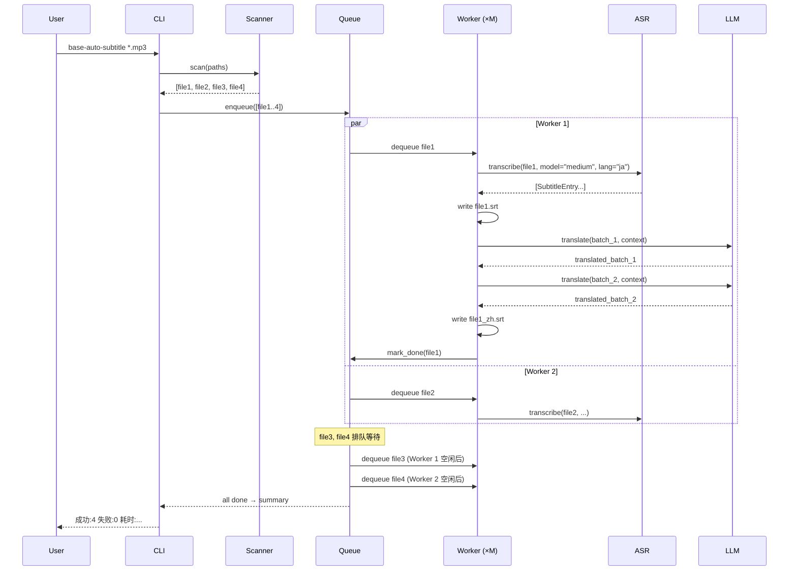

# Base Auto Subtitle — Design

## 架构概览

```
┌─────────────────────────────────────────────────────┐
│                     CLI Layer                        │
│              (argparse / click)                      │
└─────────────────────┬───────────────────────────────┘
                      │
┌─────────────────────▼───────────────────────────────┐
│                  Orchestrator                        │
│  ┌──────────┐  ┌──────────┐  ┌──────────────────┐  │
│  │ Scanner  │  │  Queue   │  │  Worker Pool      │  │
│  │ (glob +  │  │ (FIFO)   │  │  (asyncio.Sem)    │  │
│  │  filter) │  │          │  │  M concurrent jobs │  │
│  └──────────┘  └──────────┘  └──────────────────┘  │
└──────┬──────────────────────────────┬───────────────┘
       │                              │
┌──────▼──────────┐    ┌──────────────▼───────────────┐
│   ASR Module    │    │   Translation Module          │
│                 │    │                               │
│ faster-whisper  │    │ ┌───────────────────────────┐ │
│ CTranslate2     │    │ │ Context Window Builder    │ │
│ model mgr       │    │ │ (sliding overlap batches) │ │
│ (~/.subforge/   │    │ └───────────────────────────┘ │
│  models/)       │    │ ┌───────────────────────────┐ │
│                 │    │ │ OpenAI-compatible Client   │ │
│                 │    │ │ (httpx + retry logic)      │ │
└─────────────────┘    │ └───────────────────────────┘ │
                       └───────────────────────────────┘
```

流水线方向：`扫描 → 入队 → ASR（源语言SRT）→ 时间轴微调 → 翻译（目标语言SRT）→ 完成`

## 模块划分

| 模块 | 职责 | 对应需求 |
|---|---|---|
| `cli.py` | 参数解析、帮助信息、入口 | R5.1–R5.3 |
| `scanner.py` | 文件扫描、格式过滤、目录递归 | R1.1, R1.2 |
| `orchestrator.py` | 队列调度、并发控制、进度汇总 | R4.1–R4.4, R6.1–R6.2 |
| `asr/engine.py` | faster-whisper 封装：加载模型、转写、输出 SRT | R2.1–R2.4 |
| `asr/model_manager.py` | 模型下载、缓存、路径管理（`~/.subforge/models/`）| R2.1 |
| `translate/llm_client.py` | OpenAI 兼容 API 调用、重试、鉴权 | R3.6, R3.7 |
| `translate/context.py` | 滑动上下文窗口构建、批次拆分与拼接 | R3.1, R3.2 |
| `translate/srt_io.py` | SRT 文件读写、时间戳格式化 | R2.4, R3.5 |
| `models.py` | 数据类：`Job`, `SubtitleEntry`, `JobStatus` | — |
| `config.py` | CLI 参数 → 运行配置的归一化；配置文件读取 | R5.1, D6 |
| `timeline.py` | 时间轴微调：合并过短字幕条目、调整间隔 | R2.4（可选） |

## 数据模型

### 内部数据结构

```python
@dataclass
class SubtitleEntry:
    index: int           # 序号
    start: float         # 起始时间(秒)
    end: float           # 结束时间(秒)
    text: str            # 字幕文本

@dataclass
class Job:
    id: str              # UUID
    file_path: Path      # 源文件路径
    status: JobStatus    # QUEUED | ASR_RUNNING | TRANSLATING | DONE | FAILED
    source_lang: str     # 源语言代码
    target_lang: str     # 目标语言代码
    model_size: str      # ASR 模型大小
    asr_progress: float  # 0.0–1.0
    translate_progress: float
    error: str | None
    started_at: float | None
    finished_at: float | None

class JobStatus(Enum):
    QUEUED = "queued"
    ASR_RUNNING = "asr_running"
    TRANSLATING = "translating"
    DONE = "done"
    FAILED = "failed"
```

### 输出文件命名约定

```
源文件:   /path/to/work.mp3
源语言字幕: /path/to/work.srt           ← 日语
目标语言字幕: /path/to/work_zh.srt      ← 简体中文
```

`--output-dir` 指定时，输出到该目录，保持源文件名不变。

### 配置文件（`~/.subforge/config.toml`）

采用 TOML 格式，存放用户偏好。CLI 参数优先级高于配置文件。

```toml
[asr]
model = "medium"          # tiny/base/small/medium/large
source_lang = "ja"

[translate]
target_lang = "zh"
batch_size = 20           # K: 每批次待译条目数
context_size = 10         # N: 前后上下文条数

[llm]
api_key = ""              # 留空则从环境变量 LLM_API_KEY 读取
base_url = "https://api.openai.com/v1"
model = "gpt-4o"

[processing]
concurrency = 2
output_dir = ""           # 留空表示与源文件同目录
```

配置文件不存在时，使用以上默认值生成一份。用户可手工编辑。

### 无持久化数据库

v0.1 无需数据库。运行状态仅在内存中维护，进程退出后不保留。无断点续跑需求。

## 接口契约

### CLI 接口

```
base-auto-subtitle INPUT [INPUT ...] [OPTIONS]

INPUT                    一个或多个文件/目录路径（必填）
--model MODEL            ASR 模型 (默认: 来自 config.toml 的 asr.model，fallback medium)
--source-lang LANG       源语言代码 (默认: 来自 config.toml，fallback ja)
--target-lang LANG       目标语言代码 (默认: 来自 config.toml，fallback zh)
--concurrency N          最大并行文件数 (默认: 来自 config.toml，fallback 2)
--llm-api-key KEY        OpenAI API Key (默认: 环境变量 LLM_API_KEY)
--llm-base-url URL       OpenAI API Base URL (默认: 来自 config.toml，fallback https://api.openai.com/v1)
--llm-model MODEL        LLM 模型名 (默认: 来自 config.toml，fallback gpt-4o)
--config PATH            配置文件路径 (默认: ~/.subforge/config.toml)
--output-dir DIR         输出目录 (默认: 源文件同目录)
-h, --help               显示帮助
```

优先级：**CLI 参数 > 环境变量 > config.toml > 硬编码默认值**

### LLM API 契约（OpenAI Chat Completions 兼容）

```
POST {LLM_BASE_URL}/chat/completions
Authorization: Bearer {LLM_API_KEY}
Content-Type: application/json

{
  "model": "{LLM_MODEL}",
  "messages": [
    {"role": "system", "content": "你是一个专业的日语→中文翻译..."},
    {"role": "user", "content": "上下文 + 待翻译字幕条目"}
  ],
  "temperature": 0.3,
  "max_tokens": 4096
}
```

System prompt 固定为翻译指令 + 上下文说明。User message 由 `context.py` 构建，包含前后条目的参考译文和当前批次待译条目。

### 错误码（内部）

| 错误类型 | 含义 | 处理 |
|---|---|---|
| `FILE_UNSUPPORTED` | 文件格式不支持 | 跳过，输出警告 ← R1.1 |
| `MODEL_NOT_FOUND` | 本地无模型文件 | 自动下载后继续 ← R2.1 |
| `ASR_FAILED` | 转写异常 | 标记文件失败，继续下一个 ← R6.2 |
| `LLM_TIMEOUT` | API 超时 | 指数退避重试(最多3次) ← R3.6 |
| `LLM_RATE_LIMITED` | API 限流 | 指数退避重试(最多3次) ← R3.6 |
| `LLM_AUTH_ERROR` | 鉴权失败 | 重试最多3次，均失败则终止该文件 ← R3.6 |
| `TRANSLATION_FAILED` | 重试耗尽 | 标记文件失败，输出源语言 SRT 仅 ← R3.6 |

## 关键流程时序图



## 错误处理与降级

| 场景 | 策略 |
|---|---|
| ASR 模型未下载 | 首次运行时通过 faster-whisper 内置机制自动下载至 `~/.subforge/models/` |
| ASR 转写崩溃 | 捕获异常，标记 `FAILED`，输出错误信息到 stderr，继续下一文件 |
| LLM API 超时 | 指数退避：1s → 2s → 4s，最多 3 次 |
| LLM API 限流 429 | 读取 `Retry-After` 头，若无可取则指数退避 |
| LLM 鉴权失败 401 | 立即报错，不重试（非临时故障） |
| 翻译某批次失败 | 重试，耗尽后标记该文件 `FAILED`，但保留已生成的源语言 SRT |
| 文件格式不支持 | 跳过，输出 `Skipping: xxx (unsupported format)` |

## 安全与权限

- API Key 通过环境变量 `LLM_API_KEY` 或 CLI `--llm-api-key` 传入，不在代码中硬编码
- 日志中不记录 API Key 的完整值（仅显示前4后4字符）
- 不对用户文件做任何修改，仅在旁边写入新 SRT 文件
- 模型下载通过 HTTPS（HuggingFace Hub），不涉及用户数据上传

## 技术决策（ADR）

### D1. 选择 Python 3.10+ 作为实现语言
- **Context**: 需要与 faster-whisper（Python 原生库）深度集成；LLM 客户端调用以 I/O 为主。
- **Decision**: Python 3.10+。
- **Alternatives**: Go（ASR 绑定不成熟）；Rust（开发速度慢，生态不如 Python）；Node.js（ASR 支持弱）。
- **Consequences**: 打包给非开发者用户时需要 PyInstaller/Nuitka 等工具（v0.1 CLI 阶段暂不处理）。

### D2. 并发模型：asyncio + Semaphore
- **Context**: 翻译阶段是 I/O 密集型（HTTP 调用 LLM），ASR 阶段是 CPU/GPU 密集型（CTranslate2）。
- **Decision**: 使用 `asyncio.Semaphore` 控制并发文件数；ASR 在 `ThreadPoolExecutor` 中执行（faster-whisper 的 CTranslate2 底层释放 GIL）；LLM 调用使用原生 `asyncio`（httpx 异步客户端）。
- **Alternatives**: 纯 `multiprocessing` — 进程开销大，跨进程传字幕数据序列化成本高；纯 `ThreadPoolExecutor` — 对 asyncio 生态的 LLM 客户端不友好。
- **Consequences**: 单个 Worker 内 ASR 阶段阻塞线程但不阻塞事件循环；`--concurrency` 需用户根据 GPU 显存合理设置（默认 2）。

### D3. 滑动上下文窗口的批次策略
- **Context**: GPT-Subtrans 使用前后各 N 条上下文 + 当前批次的方式保证翻译一致性。
- **Decision**: 每个批次包含 `K` 条待译条目，前面附 `N` 条已译条目的原文+译文作为上下文（首批次无前上下文），后面附 `N` 条原文作为前瞻。相邻批次共享重叠区域，避免边界不一致。
- **Alternatives**: 整文件一个 prompt — 长音频（1h+）超出 LLM 上下文窗口；逐条翻译 — 丢失上下文，术语不一致。
- **Consequences**: `K=20, N=10` 作为默认值；需要额外的 prompt token 开销（预估每次 ~500 tokens for context），但换来翻译质量。

### D4. ──output-dir 的行为
- **Context**: 用户可能需要将字幕集中输出到某个目录，而非散落在源文件旁边。
- **Decision**: `--output-dir` 存在时所有 SRT 写入该目录，保持源文件名（仅改扩展名和语言后缀）；不存在时写入源文件同目录。
- **Alternatives**: 始终保持同目录输出（简单但不够灵活）。
- **Consequences**: 需处理同名文件冲突（同名源文件在不同目录下时）— 报错退出，让用户手工解决。

### D5. 不使用数据库（v0.1）
- **Context**: 是否需要持久化任务状态以支持断点续跑。
- **Decision**: v0.1 不引入数据库，状态仅存内存。进程退出则任务丢失。
- **Consequences**: 简单，但无法恢复中断的批次处理。若用户反馈强烈可在后续版本加入 SQLite。

### D6. 配置文件格式选择 TOML
- **Context**: 翻译批次参数（K、N）、LLM 地址、模型名等不适合每次在 CLI 输入，需要配置文件持久化。
- **Decision**: 使用 TOML 格式，存放于 `~/.subforge/config.toml`。Python ≥ 3.11 内置 `tomllib` 解析，无需额外依赖。
- **Alternatives**: INI — 过于扁平，`[llm]` 这类语义分组表达力弱；YAML — 需 `pyyaml` 额外依赖，缩进敏感易出错。
- **Consequences**: TOML 在 Python 生态已成事实标准（pyproject.toml）。CLI 参数优先级 > 配置文件 > 硬编码默认值。

### D7. 分发策略：先 PyPI，后 exe
- **Context**: CLI 工具如何触达不一定是开发者的终端用户。
- **Decision**: v0.1 通过 `uv` / `pip` 以 Python 包形式分发（PyPI 或 GitHub + pip install git+URL）。v0.x 成熟后，用 PyInstaller 打包单文件 exe 放在 GitHub Releases。不做 msi。
- **Alternatives**: exe 首发 — 对 native 依赖（CTranslate2）的 PyInstaller 打包配置成本高，早期迭代改代码后需反复重新打包；msi — 对 CLI 工具过度，通常用于 GUI 桌面软件。
- **Consequences**: v0.1 用户需安装 Python 3.11+ 和 UV，门槛略高但可接受（早期用户以爱好者为主）。跨平台天然成立（pip/uv 在 Windows/macOS/Linux 一致）。

### D8. 依赖管理工具：UV
- **Context**: pip 安装速度慢，锁定依赖不够可靠。
- **Decision**: 使用 [UV](https://github.com/astral-sh/uv) 作为开发和安装工具——`uv sync` 管理依赖，`uv run` 执行命令，`uv.lock` 锁定版本。
- **Alternatives**: Poetry — 成熟但较慢；pip-tools — 功能不够集成；PDM — 另一选择但 UV 势头更强。
- **Consequences**: 全团队需安装 UV；CI 中 UV 比 pip 快 10–100 倍；`pyproject.toml` + `uv.lock` 的组合是当前 Python 生态最佳实践。

## 需求覆盖

| 需求 | 实现位置 |
|---|---|
| R1.1, R1.2 文件输入 | `scanner.py` |
| R2.1–R2.4 ASR | `asr/engine.py`, `asr/model_manager.py` |
| R3.1–R3.5, R3.7 翻译 | `translate/context.py`, `translate/llm_client.py`, `translate/srt_io.py` |
| R3.6 重试与错误处理 | `translate/llm_client.py` |
| R4.1–R4.4 并发队列 | `orchestrator.py` |
| R5.1–R5.3 CLI | `cli.py` |
| R6.1–R6.2 进度日志 | `orchestrator.py` (tqdm / rich.progress) |

## 依赖清单

| 包 | 用途 | 版本 |
|---|---|---|
| `faster-whisper` | ASR 引擎 | >=1.0 |
| `httpx` | 异步 HTTP 客户端（LLM API） | >=0.27 |
| `tenacity` | 重试策略（指数退避） | >=8.0 |
| `tqdm` | 进度条显示 | >=4.0 |
| `click` | CLI 框架（比 argparse 更适合多参数场景） | >=8.0 |

Python ≥ 3.11（tomllib 内置），Windows 优先平台。

开发工具链：**[UV](https://github.com/astral-sh/uv)** 管理依赖、虚拟环境、锁定版本（`uv sync` / `uv run` / `uv.lock`）。

## 未决问题

- ~~❓ 翻译 context window 的 K 和 N 是否合理？需不需要让用户可配置？~~
  → **已确认**：K=20, N=10 作为默认值，存放于 `~/.subforge/config.toml` [translate] 段，用户可编辑。
- ~~❓ 字幕时间轴微调放在 ASR 阶段还是翻译阶段之后？~~
  → **已确认**：放在 ASR 阶段之后、翻译阶段之前。
- ~~❓ 配置文件格式选 INI / TOML / YAML？~~
  → **已确认**：TOML，Python 3.11+ 内置解析，可读性好，生态标准。
- ~~❓ 分发的最终形态是 exe、msi 还是跨平台包？~~
  → **已确认**：v0.1 PyPI/uv 包（跨平台），v0.x 后再打 exe；不做 msi。
- ~~❓ 依赖管理工具？~~
  → **已确认**：UV（`uv sync` / `uv run` / `uv.lock`）。
