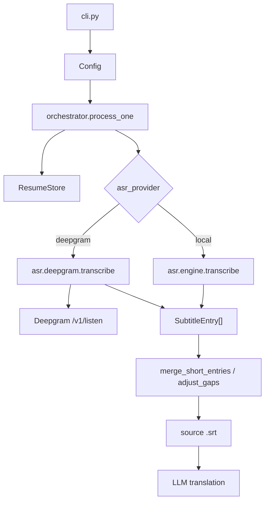
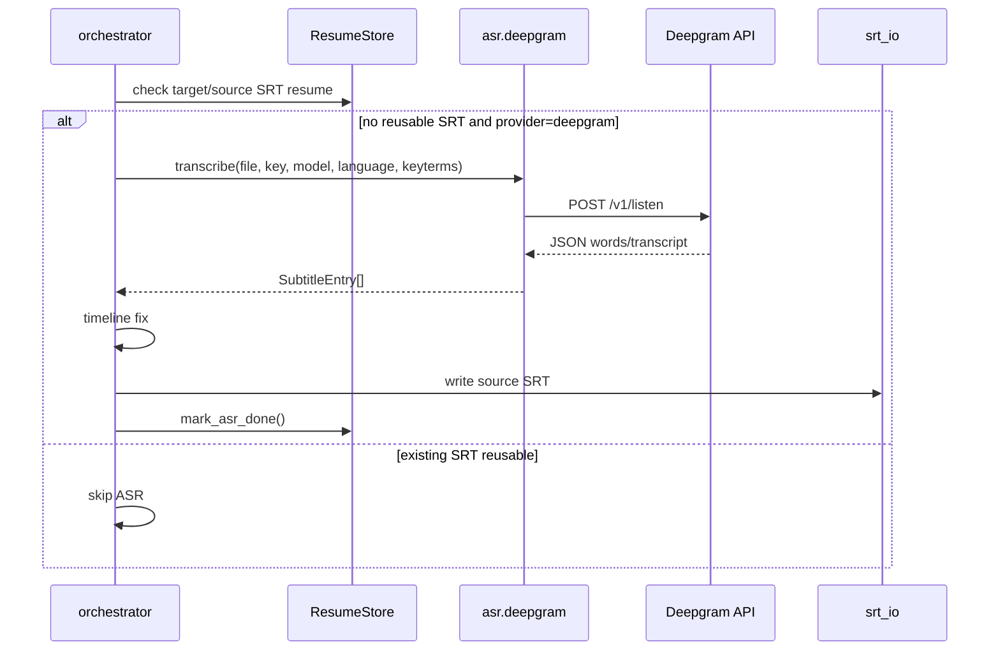
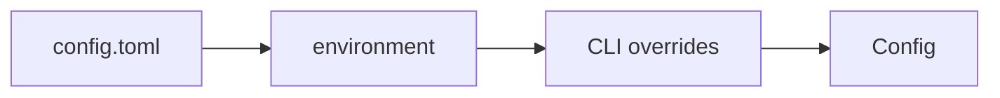

# Deepgram ASR Provider — Design

## 架构概览

新增 Deepgram provider 时不重写现有 faster-whisper 引擎。`config.py` 负责加载 ASR provider 与 Deepgram 配置，`cli.py` 暴露 provider 和必要覆盖项，`orchestrator.py` 在 ASR 阶段按 provider 分派到本地 `asr.engine.transcribe()` 或新增的 `asr.deepgram.transcribe()。两条路径都返回 `list[SubtitleEntry]`，后续 timeline、SRT、翻译和断点续跑保持共用。



覆盖：R1.1–R1.4, R4.1–R4.4, R5.1–R5.4

## 数据模型

### Config 字段

`Config` 新增字段：

- `asr_provider: str = "local"` ← R1.1
- `deepgram_api_key: str = ""` ← R2.1–R2.4
- `deepgram_model: str = "nova-3"` ← R3.1, R3.2
- `deepgram_keyterms: list[str] = field(default_factory=list)` ← R3.5

`DEFAULT_CONFIG_TOML` 新增：

```toml
[asr]
provider = "local"   # local / deepgram

[deepgram]
api_key = ""         # or env DEEPGRAM_API_KEY
model = "nova-3"
keyterms = []        # e.g. ["気付け", "布団", "性癖"]
```

环境变量覆盖：

- `DEEPGRAM_API_KEY` → `[deepgram].api_key` ← R2.3

CLI 覆盖：

- `--asr-provider local|deepgram` ← R1.2–R1.4
- `--deepgram-api-key TEXT` ← R2.1
- `--deepgram-model TEXT` ← R3.2

keyterm 暂不加 CLI，避免命令行复杂化；用户通过 config.toml 管理。← R3.5

### Resume fingerprint

`ResumeStore._config_fingerprint()` 增加：

- `asr_provider`
- `deepgram_model`
- `deepgram_keyterms`

不保存也不匹配 `deepgram_api_key`。这样 local 与 deepgram 的断点不会互相复用，Deepgram 模型或 keyterm 变更也会使旧断点失效。← R5.4, 安全性

## 接口契约

### CLI

```text
--asr-provider [local|deepgram]    ASR provider (default: local)
--deepgram-api-key TEXT           Deepgram API key (env: DEEPGRAM_API_KEY)
--deepgram-model TEXT             Deepgram model name (default: nova-3)
```

无效 provider 由 Click Choice 在启动前拒绝。← R1.3

### Deepgram ASR 模块

新增 `subforge/asr/deepgram.py`：

```python
class DeepgramError(Exception): ...
class DeepgramAuthError(DeepgramError): ...

def transcribe(
    file_path: Path,
    api_key: str,
    model: str = "nova-3",
    language: str = "ja",
    keyterms: list[str] | None = None,
    progress_callback: Callable[[float], None] | None = None,
) -> list[SubtitleEntry]:
    ...
```

请求：

- Method: `POST`
- URL: `https://api.deepgram.com/v1/listen`
- Query:
  - `model=<deepgram_model>`
  - `language=<source_lang>`
  - `smart_format=true`
  - `punctuate=true`
  - `paragraphs=false`
  - repeated `keyterm=<term>` for each configured keyterm
- Headers:
  - `Authorization: Token <api_key>`
  - `Content-Type: audio/<derived format>`，MP3 使用 `audio/mpeg`
- Body: audio bytes

返回解析：

优先读取 `results.channels[0].alternatives[0].words`。每个 word 包含 `word/start/end` 时，按标点或停顿聚合成字幕条目；如果没有 words，则回退为单条 `SubtitleEntry`，起止时间使用 `metadata.duration`。← R4.1, R4.5

聚合策略：

- 目标字幕段最大时长约 6 秒
- 停顿超过 0.8 秒切段
- 文本遇到 `。！？!?` 可切段
- 每条 `SubtitleEntry.index` 从 1 连续编号

### Orchestrator 分派

新增私有 helper：

```python
def _run_asr(job: Job, config: Config, progress_callback) -> list[SubtitleEntry]:
    if config.asr_provider == "local":
        ...
    if config.asr_provider == "deepgram":
        ...
    raise ValueError(...)
```

`process_one()` 继续用 `asyncio.to_thread()` 调用 `_run_asr()`，避免阻塞事件循环。Deepgram 路径不调用 `ensure_model()`，本地路径保持现状。← R1.1, R1.2, R4.2–R4.4

## 关键流程

### Deepgram 转写流程



### 配置优先级



优先级仍为：CLI > env > config.toml > defaults。← R2.3, R2.4

## 错误处理与降级

- Deepgram provider 缺 API key：抛 `DeepgramAuthError("Deepgram API key is required")`，当前文件失败，批量继续。← R2.2, R6.3
- HTTP 401/403：抛 `DeepgramAuthError`，不重试。← R6.1
- HTTP 429/500/502/503/504：指数退避重试最多 3 次。← R6.2
- 网络超时：指数退避重试最多 3 次。← R6.2
- 非重试 HTTP 错误：抛 `DeepgramError`。← R6.4
- JSON 缺少可用 transcript：抛 `DeepgramError("Deepgram produced no transcript")`。← R4.5
- 日志只输出模型、语言、文件名、HTTP 状态，不输出完整 key。← R2.5, R6.4

## 安全与权限

- 不在日志、异常消息、断点状态或测试快照中保存完整 Deepgram API key。← R2.5
- `ResumeStore` fingerprint 不包含 `deepgram_api_key`。← R5.4
- README 提醒 Deepgram 是云端服务，会上传音频并产生 API 费用。← 非功能成本控制

## 技术决策(ADR)

### D1. 使用 provider 字段而不是复用 model 字段

- **Context**: 当前 `model` 字段表示 faster-whisper 模型大小，Deepgram 的 `nova-3` 语义不同。
- **Decision**: 新增 `asr_provider`，Deepgram 模型放在 `deepgram_model`。
- **Alternatives**: 让 `--model nova-3` 自动选择 Deepgram。
- **Consequences**: CLI 更清晰，避免本地和云端模型名混用。

### D2. Deepgram 结果统一转换为 SubtitleEntry

- **Context**: 后续 timeline、SRT、翻译流程已基于 `SubtitleEntry`。
- **Decision**: Deepgram 模块只负责 API 调用和格式转换。
- **Alternatives**: 让 orchestrator 处理 Deepgram 原始 JSON。
- **Consequences**: provider 接入边界清晰，后续增加其它云 ASR 也可复用相同接口。

### D3. 默认不启用 detect_language

- **Context**: 实测 `nova-3 + detect_language=true` 虽检测到 `ja`，但输出出现异常空格拆字。
- **Decision**: Deepgram 默认使用 `language=<source_lang>`。
- **Alternatives**: 默认自动检测语言。
- **Consequences**: 日语同人音声场景更稳定；用户仍可通过未来配置扩展自动检测。

### D4. keyterm 从配置文件读取

- **Context**: keyterm 常是一组角色名、术语和易错词，不适合每次 CLI 手写。
- **Decision**: 首期只支持 config.toml `[deepgram].keyterms`。
- **Alternatives**: 新增多次 `--deepgram-keyterm` CLI 参数。
- **Consequences**: CLI 保持简洁；需要文档说明配置方式。

## 需求覆盖

- R1.1 → `asr_provider` 默认 `local`，本地 faster-whisper 路径保持现状。
- R1.2 → `--asr-provider deepgram` 分派到 `asr.deepgram.transcribe()`。
- R1.3 → Click Choice 和 `_run_asr()` 双重防御无效 provider。
- R1.4 → CLI help 显示 `--asr-provider`。
- R2.1 → Deepgram 请求使用 `Authorization: Token ...`。
- R2.2 → Deepgram provider 缺 key 抛 `DeepgramAuthError`。
- R2.3 → `DEEPGRAM_API_KEY` 环境变量覆盖配置。
- R2.4 → `[deepgram].api_key` 作为配置来源。
- R2.5 → 日志和错误信息使用掩码或不输出 key。
- R3.1 → `deepgram_model` 默认 `nova-3`。
- R3.2 → CLI/config 可覆盖 `deepgram_model`。
- R3.3 → 请求 query 使用当前 `source_lang`。
- R3.4 → `source_lang` 默认仍为 `ja`。
- R3.5 → `[deepgram].keyterms` 转为 repeated `keyterm` query 参数。
- R4.1 → Deepgram JSON words/transcript 转为 `SubtitleEntry`。
- R4.2 → Deepgram 输出进入现有 timeline。
- R4.3 → orchestrator 写源语言 SRT。
- R4.4 → 源语言 SRT 后进入现有翻译流程。
- R4.5 → 空结果抛错并标记文件失败。
- R5.1 → 目标 SRT 恢复判断在 ASR 分派前执行。
- R5.2 → 源 SRT 恢复判断在 ASR 分派前执行。
- R5.3 → `--force` 继续忽略 SRT 和断点，按当前 provider 重新转写。
- R5.4 → resume fingerprint 纳入 provider/model/keyterms。
- R6.1 → 401/403 映射为认证失败。
- R6.2 → 429/5xx/timeout 重试。
- R6.3 → `process_one()` 捕获异常，`process_all()` 继续其它文件。
- R6.4 → Deepgram 错误记录状态和原因但不泄露 key。

## 未决问题

- 无。
