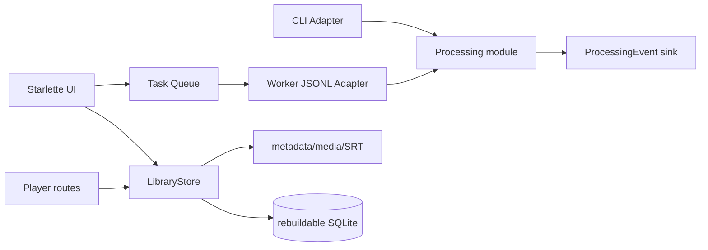

# Library UI — Design

## 架构概览

四个深模块承担复杂度，CLI 和 UI 只做 Adapter：



### 公开 seam

```python
# Processing seam
async def process_one(
    job: Job,
    config: Config,
    *,
    event_sink: EventSink | None = None,
    resume_store: ResumeStore | None = None,
) -> None: ...

# Library seam
class LibraryStore:
    @classmethod
    def initialize(cls, root: Path) -> LibraryStore: ...
    @classmethod
    def open(cls, root: Path) -> LibraryStore: ...
    def import_audio(self, request: ImportRequest) -> ImportResult: ...
    def list_items(self) -> list[LibraryItem]: ...
    def get_item(self, item_id: str) -> LibraryItem: ...
    def rebuild_index(self) -> None: ...
    def trash_item(self, item_id: str) -> None: ...

# UI seam
def create_app(deps: UiDependencies) -> Starlette: ...
```

测试和调用者不跨过这些 seam 读取私有状态。

## Slice 0：字幕路径与处理事件

### 字幕路径

新增唯一命名函数：

```python
def subtitle_path(media_path: Path, language: str, output_dir: Path | None = None) -> Path:
    # Track 01.m4a + ja => Track 01.ja.srt
```

`orchestrator`、resume 状态和后续 Library 统一调用该函数；不保留 legacy 分支。

### 事件模型

```python
@dataclass(frozen=True)
class ProcessingEvent:
    type: EventType
    job_id: str
    stage: str | None
    progress: float | None
    completed: int | None
    total: int | None
    message: str | None
    error_type: str | None
    occurred_at: str

EventSink = Callable[[ProcessingEvent], None]
```

事件发布函数吞掉 Adapter 自身异常并写 warning，不能让进度消费者破坏处理结果。事件不得包含 API Key、headers、prompt 或完整媒体绝对路径。

CLI 现有 tqdm 保留为 CLI Adapter；Worker 使用 JSONL Adapter 输出事件。Slice 0 先让核心具备事件 seam，Slice 2 再接子进程。

## Slice 1：Library

### 根目录

```text
Library/
├── library.json
├── works/RJ01546796/
├── streams/<author>/<date-title-shortid>/
├── .incoming/<import-id>/
├── .trash/
└── .subforge/index.sqlite
```

`library.json`：`schema_version`、`library_id`、`created_at`。全部 Item 内部资产路径相对 Item 目录。

### metadata.json

```json
{
  "schema_version": 1,
  "item_id": "uuid",
  "kind": "rj_work",
  "title": "...",
  "rj_code": "RJ01546796",
  "author": null,
  "created_at": "...",
  "updated_at": "...",
  "tracks": [
    {
      "track_id": "uuid",
      "media": "media/原文件名.m4a",
      "sha256": "...",
      "size": 123,
      "source_language": "ja",
      "target_language": "zh",
      "status": "waiting"
    }
  ]
}
```

直播归档使用人类可读目录 + `item_id[:6]`。外部来源路径可记录为展示信息，但不参与播放/身份。

### 原子与安全导入

- 打开源文件只读，目标使用独占创建。
- 复制到 `.incoming/<import-id>/media/<filename>.part`，单次读取同时更新 SHA-256 和进度。
- 完成后 flush + `os.fsync`；同库哈希命中则删除 incoming 并返回既有 Track。
- 写 metadata 临时文件、fsync、replace。
- 同一文件系统用 `Path.replace` 提升正式目录。
- 任何失败不碰源文件；重试清理/重建 incoming。

### SQLite

表只缓存 `items`、`tracks`、`tasks` 和 `llm_profiles`；不存字幕文本和密钥。启动读取 SQLite 后扫描 metadata mtime 增量同步；SQLite 异常时移走损坏文件再重建。

## Slice 2：UI 与任务队列

### 技术栈

Starlette、Uvicorn、Jinja2、vendored HTMX、少量 JS。默认依赖。`subforge ui` 只绑定 `127.0.0.1` 并自动打开浏览器。

### 安全会话

- 启动生成 256-bit URL-safe token。
- `/?token=` 使用 `hmac.compare_digest` 校验，设置 HttpOnly + SameSite=Strict session cookie，然后 303 到无 token URL。
- 每个 session 有 CSRF token；POST 同时校验 cookie、表单/头 token、Host 和 Origin。
- 媒体路由接收 ID，通过 LibraryStore 解析，不接收路径。

### 原生选择器 Adapter

```python
class FilePicker(Protocol):
    def choose_audio(self) -> Path | None: ...
    def choose_directory(self) -> Path | None: ...
```

Windows Adapter 可用系统文件对话框；测试用 Fake Adapter。选择器结果只保存在服务器端短期 pending selection，浏览器收到 opaque selection ID，不收到完整路径。

### LLM Profiles

Profile 配置保存于用户配置目录的独立 JSON/TOML（不放 Library）。Profile 包含稳定 ID、名称、base URL、model 和可选 Key。UI 响应只返回掩码。环境变量覆盖时不读取/显示原值。

### Worker

`python -m subforge.worker --request <json>`，stdout 只输出 JSONL 事件，stderr 供诊断日志。主进程用 `asyncio.create_subprocess_exec`，逐行解析事件并更新 SQLite/SSE broker。任务请求通过权限受限临时 JSON 传入；Key 在启动时解析但不写任务快照。取消先 terminate/控制信号，5 秒后 kill。

### SSE

每任务一个内存订阅队列，SQLite 保存最后状态。页面首次加载读 SQLite，之后 `/tasks/<id>/events` 订阅新事件；断线重连不要求重放全部事件。

## Slice 3：播放器

### Range 媒体响应

路由 `/tracks/{track_id}/media`：由 ID 解析 Library 内相对路径，拒绝越界 symlink/path traversal。支持单 Range：`bytes=start-end`、`206`、`Content-Range`、`Accept-Ranges`。无 Range 返回普通流响应。

### 字幕

`/tracks/{track_id}/subtitles/{lang}` 只允许 Track metadata 中的 source/target language，读取 `<stem>.<lang>.srt` 并返回：

```json
[{"start": 0.0, "end": 1.2, "text": "..."}]
```

播放器 JS 在 `timeupdate` 用单调游标查找当前字幕，seek 时二分定位。只有一份字幕时仍展示；无字幕时展示等待/失败状态。

## 任务操作

- Continue：原 snapshot + Item resume store。
- Retranslate：备份 target SRT，清翻译状态，保留 source SRT。
- From scratch：备份两份 SRT，建立新 resume，媒体只读。
- Trash：停止任务后 Item 目录移动到 `.trash/<item-id>-<timestamp>`。

## 安全与非功能约束

- 主 UI 进程不 import/load faster-whisper Worker 路径。
- 所有 Key 输出通过统一 secret masker；日志 Adapter 过滤 Authorization/known keys。
- 不跟随 Library 外 symlink；所有 resolved asset path 必须属于 root。
- UI 静态资源随 wheel 发布，无 CDN。
- 空闲 UI 主进程目标 `< 200MB`。
