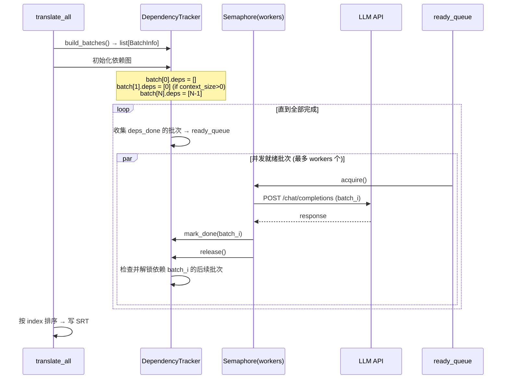

# SubForge v0.2 优化 — Design

## 架构概览

v0.2 不改动核心流水线结构（Scan → ASR → Timeline → Translate → SRT），在现有模块内做增强：

```
                        ┌─────────────────────────┐
                        │     orchestrator.py      │
                        │  ┌───────────────────┐   │
                        │  │ tqdm bar per Job   │   │ ← R1
                        │  │ (position=n)       │   │
                        │  └───────────────────┘   │
                        │  ┌───────────────────┐   │
                        │  │ logger.info/err    │   │ ← R3
                        │  └───────────────────┘   │
                        └──────────┬──────────────┘
                                   │
          ┌────────────────────────┼────────────────────────┐
          │                        │                        │
┌─────────▼─────────┐  ┌──────────▼──────────┐  ┌──────────▼──────────┐
│   asr/engine.py   │  │ translate/context.py │  │    config.py        │
│                   │  │                      │  │                     │
│ callback(progress)│  │ DependencyTracker    │  │ [translate]         │
│ local_files_only  │  │ + asyncio.Semaphore  │  │   workers = 4       │
│ = cached check    │  │ concurrent batch LLM │  │ [logging]           │
│                   │  │                      │  │   level = "INFO"    │
└───────────────────┘  └──────────────────────┘  │   file = "subforge. │
                                                   │         log"       │
                                                   └─────────────────────┘
```

## 模块改动清单

| 模块 | 变更类型 | 内容 |
|------|----------|------|
| `config.py` | 修改 | 新增 `[translate] workers`、`[logging] level` / `file` 字段、日志初始化函数 |
| `asr/model_manager.py` | 重写 | 新增本地模型文件检测逻辑，返回缓存状态 |
| `asr/engine.py` | 修改 | 新增 `progress_callback` 参数；接收 `local_files_only` 信号 |
| `translate/context.py` | 重写 | 串行循环 → 依赖感知并发调度 |
| `translate/llm_client.py` | 修改 | `print()` → `logging`，保留重试逻辑 |
| `orchestrator.py` | 修改 | `print()` → `logging`；集成 tqdm 进度条管理 |
| `cli.py` | 修改 | 新增 `--log-level` CLI 参数；传递进度回调上下文 |
| `models.py` | 不改 | `asr_progress` / `translate_progress` 字段已在 v0.1 定义，直接使用 |

## 数据模型

### Config 新增字段

```python
@dataclass
class Config:
    # ... existing fields ...
    # Translate (new field)
    translate_workers: int = 8   # ← R2.1, from [translate] workers
    # Logging (new fields)
    log_level: str = "INFO"      # ← R3.1, R3.3, from [logging] level
    log_file: str = "subforge.log"  # ← R3.6, from [logging] file
```

### 配置文件新增段落（DEFAULT_CONFIG_TOML）

```toml
[translate]
target_lang = "zh"
batch_size = 20
context_size = 10
workers = 8                  # ← NEW: 翻译批次并发数

[logging]                    # ← NEW: 整个段落
level = "INFO"               #   DEBUG / INFO / WARNING / ERROR
file = "subforge.log"        #   日志文件路径
```

### 无新增持久化

进度条状态、日志配置均为进程内存态，不持久化。

## 接口契约

### CLI 新增参数

```
--log-level LEVEL    日志级别: DEBUG/INFO/WARNING/ERROR (默认: 来自 config.toml，fallback INFO)
```

优先级：`--log-level` CLI > 环境变量 `SUBFORGE_LOG_LEVEL` > `config.toml [logging] level` > 默认 INFO。

### ASR engine 签名变更

```python
# Before
def transcribe(file_path, model_size, language, models_dir) -> list[SubtitleEntry]

# After
def transcribe(
    file_path,
    model_size,
    language,
    models_dir,
    progress_callback: Callable[[float], None] | None = None,  # ← R1.1
    local_files_only: bool = False,  # ← R4.1
) -> list[SubtitleEntry]
```

`progress_callback` 接收 0.0–1.0 的进度值。`local_files_only=True` 时，faster-whisper 通过 `local_files_only=True` kwarg 传给底层 `snapshot_download`，跳过 HF Hub 请求。

### translate_all 签名与行为变更

```python
# Before
async def translate_all(entries, config, llm_translate_fn) -> list[SubtitleEntry]

# After
async def translate_all(
    entries,
    config,
    llm_translate_fn,
    progress_callback: Callable[[int, int], None] | None = None,  # (done, total)
) -> list[SubtitleEntry]
```

内部并发模型从 `for batch in batches` 改为 `DependencyTracker + asyncio.Semaphore(workers)`。

### 日志格式

```
2026-05-16 14:30:01  INFO    [orchestrator] [abc12345] work.mp3: ASR started
2026-05-16 14:30:01  WARNING [asr.engine]   Model medium not cached, downloading...
```

格式：`时间戳 级别 [模块名] [job_id(可选)] 消息`

## 关键流程

### 1. ASR 进度条与本地模型检测

```mermaid
sequenceDiagram
    participant O as Orchestrator
    participant MM as ModelManager
    participant AE as ASR Engine
    participant FW as faster-whisper
    participant TQ as tqdm

    O->>MM: ensure_model(model_size, models_dir)
    MM->>MM: Check models_dir/models--Systran--faster-whisper-{size}/
    alt 模型文件存在
        MM-->>O: (True, local_files_only=True)
    else 模型文件不存在
        MM-->>O: (True, local_files_only=False)
    end

    O->>TQ: tqdm(total=1.0, desc="[ASR] file.mp3", position=n)
    O->>AE: transcribe(..., progress_callback, local_files_only)
    AE->>FW: WhisperModel(model_size, local_files_only=True)
    FW->>FW: snapshot_download(..., local_files_only=True)
    Note over FW: 本地有 → 直接加载; 本地无 → 下载后加载

    loop 每个 segment
        FW-->>AE: segment
        AE->>O: progress_callback(current_duration / total_duration)
        O->>TQ: update progress
    end

    AE-->>O: [SubtitleEntry...]
    O->>TQ: close() at 100%
```

### 2. 翻译批次并发调度

核心约束：批次 N 的前置上下文依赖批次 N-1 的译文（当 `context_size > 0` 时）。因此引入 `DependencyTracker` 追踪每个批次就绪状态。



**并发度分析**：
- `context_size = 0`：所有批次独立，`workers` 个批次真正并行
- `context_size < batch_size`（默认情况）：批次 N 仅依赖 N-1，依赖链为线性 → 有效并行度 = 1（流水线效果）
- 用户可通过调小 `context_size` 或设 0 换取更高并行度

### 3. 日志系统初始化

```mermaid
flowchart TD
    START["main()"] --> LC[load_config]
    LC --> INIT["setup_logging(config)"]
    INIT --> ROOT[创建 root logger]
    ROOT --> LVL[设置级别: config.log_level]
    LVL --> FMTR[设置 Formatter]
    FMTR --> SH[StreamHandler(sys.stderr)]
    FMTR --> FH[FileHandler(config.log_file)]
    SH --> FLT[Filter: 放行 INFO+<br/>拒绝 DEBUG]
    FH --> FLT2[接受所有级别]
    SH --> ROOT2[添加 handler]
    FH --> ROOT2
    ROOT2 --> LOG[各模块 logger = getLogger(__name__)]
```

`StreamHandler` 绑 `DEBUGFilter`：仅当 log_level 为 DEBUG 时才拒绝 DEBUG（其余级别正常通过）。FileHandler 接受所有级别。

## 错误处理与降级

| 场景 | 策略 |
|------|------|
| 日志文件无法创建/写入 | 捕获 `OSError`，移除 FileHandler，仅 stderr 输出，不中断流程 ← R3.5 |
| 本地模型检测到但加载失败 | 记录 WARNING，回退 `local_files_only=False` 重试 ← R4.5 |
| 翻译并发中某批次失败 | 重试逻辑不变（llm_client 内置 3 次退避），耗尽后 `LLMError` 向上传播，标记文件失败 |
| 批次依赖死锁 | 不可能 — 依赖图为有向无环图，DependencyTracker 保证只调度就绪批次 |
| tqdm 写入冲突 | tqdm 使用 `position` 参数分槽位输出，互不覆盖 ← R1.5 |

## 安全与权限

- 日志文件写入当前工作目录或用户指定路径，不涉及敏感路径
- API Key 掩码逻辑保留（`_mask_key`），日志中不输出完整 Key
- 模型本地检测仅读取文件系统，不发起网络请求 ← R4

## 技术决策（ADR）

### D1. 翻译并发：依赖感知调度器 vs 全异步发射

- **Context**：滑动上下文窗口导致批次间存在线性依赖（N 依赖 N-1 的译文）。用户要求"多批次同时翻译"但也要保证上下文质量。
- **Decision**：实现 `DependencyTracker`，追踪每个批次的依赖完成状态。仅当依赖就绪时才调度该批次。并发度由 `[translate] workers` 控制。`context_size=0` 时所有批次独立，实现完全并行。
- **Alternatives**：
  - 全异步发射（忽略依赖）— 违反 R2.2，上下文质量不可控
  - 保留串行不改 — 用户明确要求并行
  - 移除滑动上下文窗口 — 翻译质量回退，违反 v0.1 的核心设计
- **Consequences**：默认参数（context_size=10）下有效并行度 = 1，与 v0.1 性能持平。用户需调低 context_size 换取加速。架构层面为未来优化（如上下文预热、推测性翻译）留有接口。

### D2. 本地模型检测方案：huggingface_hub cache API vs 手动路径检查

- **Context**：faster-whisper 通过 `huggingface_hub.snapshot_download` 下载模型。需要判断本地是否已有模型文件来决定是否设置 `local_files_only=True`。
- **Decision**：使用 `huggingface_hub.scan_cache_dir()` 或 `try_to_load_from_cache()` 检测模型是否在 HF Hub 缓存中。检测到则传 `local_files_only=True` 给 `WhisperModel`。
- **Alternatives**：
  - 手动拼接路径 `models_dir/models--Systran--faster-whisper-{size}/snapshots/*/model.bin` — 脆弱，依赖 HF Hub 内部缓存结构
  - 始终传 `local_files_only=True`，失败后回退 — 异常驱动的正常流程，语义不清晰
- **Consequences**：引入对 `huggingface_hub` API 的依赖（faster-whisper 已依赖它，无需新增包）。检测逻辑集中在 `model_manager.py`，与下载逻辑分离。

### D3. 进度条方案：tqdm position 参数 vs rich.progress

- **Context**：需要多条进度条在同一终端互不覆盖。多文件并发时各有各的 ASR/翻译阶段。
- **Decision**：使用 tqdm 的 `position` 参数为每个活跃 Job 分配固定槽位。当 Job 完成时释放槽位供排队任务复用。
- **Alternatives**：
  - `rich.progress` — 功能更强但需新增依赖，tqdm 已在 pyproject.toml 中
  - 全局一根进度条 — 用户明确要求每文件独立
- **Consequences**：进度条数量 = min(活跃文件数, concurrency)。槽位用简单的整数池管理。

### D4. 日志系统：logging 模块 + 双 Handler

- **Context**：当前全部使用 `print(..., file=sys.stderr)`，无可配置级别、无文件输出、无时间戳。
- **Decision**：在 `config.py` 中新增 `setup_logging(config)` 函数，配置 root logger 的双 handler（StreamHandler + FileHandler）。StreamHandler 加 Filter 在非 DEBUG 模式下拒绝 DEBUG 消息。各模块使用 `logging.getLogger(__name__)`。
- **Alternatives**：
  - `loguru` — API 更友好但需新增依赖，项目规模小不划算
  - `structlog` — 结构化日志过度设计，v0.2 不需要
- **Consequences**：所有 `print()` 调用替换为 `logger.info()` / `logger.warning()` / `logger.exception()`。日志格式统一，方便排查。

### D5. 翻译并发度配置位置：TOML [translate] 段 vs CLI 参数

- **Context**：用户要求"在 toml 文件中控制"翻译并发度。
- **Decision**：仅在 `[translate]` TOML 段新增 `workers` 字段，不暴露为 CLI 参数。与 `batch_size`、`context_size` 同级。
- **Alternatives**：暴露 CLI `--translate-workers` — 违背用户明确指示。
- **Consequences**：用户修改翻译并发度需编辑 config.toml，符合"配置持久化"的使用场景。CLI 保持简洁。

## 需求覆盖

| 需求 | 实现位置 |
|------|----------|
| R1.1–R1.5 进度条 | `orchestrator.py`（tqdm 管理）、`asr/engine.py`（progress_callback）、`translate/context.py`（progress_callback） |
| R2.1–R2.4 并行翻译 | `translate/context.py`（DependencyTracker + Semaphore）、`config.py`（workers 字段） |
| R3.1–R3.6 结构化日志 | `config.py`（setup_logging）、全部模块（`print` → `logging`） |
| R4.1–R4.5 本地模型缓存 | `asr/model_manager.py`（缓存检测）、`asr/engine.py`（local_files_only） |

## 依赖清单

无新增依赖。v0.2 使用现有包：

| 包 | v0.2 用途 | 已在 v0.1 |
|---|---|---|
| `tqdm>=4.0` | 进度条（此前未使用） | ✓ |
| `huggingface_hub` | 缓存检测 API（faster-whisper 已依赖） | ✓ (间接) |
| Python `logging` | 结构化日志 | ✓ (标准库) |
| `asyncio` | 并发批次调度 | ✓ |

## 未决问题

- ~~❓ 翻译并发度 `workers` 默认值设为 4 是否合理？~~ → **已确认**：默认值设为 8。
