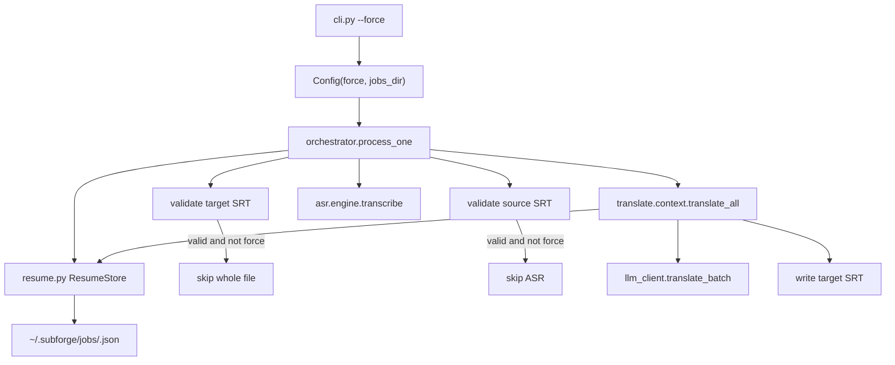
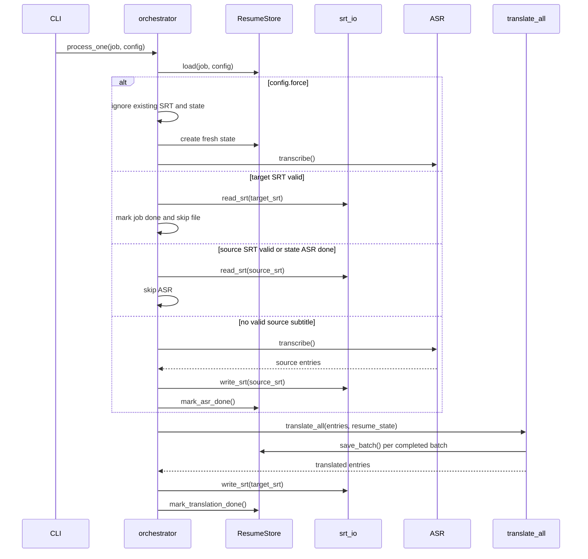
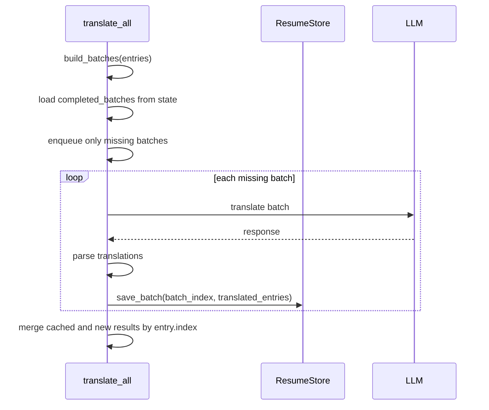

# Resume Processing — Design

## 架构概览

断点续跑新增一个独立的 `subforge.resume` 模块，负责状态文件路径、读写、校验、批次结果保存和恢复判断。现有 `cli.py` 增加 `--force` 开关，`config.py` 增加 `jobs_dir` 默认路径，`orchestrator.py` 在 ASR 与翻译阶段调用恢复能力，`translate.context.translate_all()` 接收可选断点上下文来跳过已完成批次并保存新完成批次。



覆盖：R1.1–R1.5, R2.1–R2.4, R3.1–R3.3, R4.1–R4.3, R5.1–R5.7, R6.1–R6.4, R7.1–R7.3

## 数据模型

不引入数据库。每个媒体文件一个 JSON 状态文件，统一存放在 `~/.subforge/jobs/`。文件名为 `job_key + ".json"`，`job_key` 使用当前媒体绝对路径、文件大小、mtime、源语言和目标语言计算 SHA-256，避免批量并发时互相覆盖。← R1.1, R1.2, R7.1, R7.3

### 配置字段

`Config` 新增：

- `force: bool = False`：是否强制从头开始。← R4.1, R4.2
- `jobs_dir: Path = Path.home() / ".subforge" / "jobs"`：断点状态目录。← R1.1

`DEFAULT_CONFIG_TOML` 不新增用户可编辑项；`jobs_dir` 是内部路径约定，不需要普通用户配置。

### JSON 状态结构

```json
{
  "schema_version": 1,
  "job_key": "sha256...",
  "media": {
    "path": "C:/abs/audio.m4a",
    "size": 123456,
    "mtime_ns": 1770000000000000000
  },
  "config_fingerprint": {
    "source_lang": "ja",
    "target_lang": "zh",
    "asr_model": "medium",
    "batch_size": 20,
    "context_size": 10,
    "llm_model": "deepseek-chat"
  },
  "paths": {
    "source_srt": "C:/abs/audio.srt",
    "target_srt": "C:/abs/audio_zh.srt"
  },
  "asr": {
    "status": "pending|done"
  },
  "translation": {
    "status": "pending|partial|done|failed",
    "total_batches": 5,
    "completed_batches": {
      "0": [
        {"index": 1, "start": 0.0, "end": 1.2, "text": "..."}
      ]
    }
  },
  "updated_at": "2026-06-09T12:00:00Z"
}
```

状态文件不保存 `llm_api_key`、请求 headers、完整 prompt 或其它敏感凭据。← 非功能安全性

### 状态校验

断点状态仅在以下字段完全匹配时可用：

- `schema_version`
- `media.path`
- `media.size`
- `media.mtime_ns`
- `config_fingerprint.source_lang`
- `config_fingerprint.target_lang`
- `config_fingerprint.asr_model`
- `config_fingerprint.batch_size`
- `config_fingerprint.context_size`
- `config_fingerprint.llm_model`

`translate_workers` 不参与匹配，因为它只影响并发度，不影响批次切分或结果语义。`llm_base_url` 和 `llm_api_key` 不参与匹配，避免将 endpoint 或凭据变化误当作字幕语义变化；如果用户希望重译，可使用 `--force`。← R1.3, R5.3, R5.4, R6.4

### 原子写入

`ResumeStore.save()` 写入同目录临时文件，再用 `Path.replace()` 原子替换目标 JSON。每个批次成功后立即保存，降低中断损失。← R5.2, R5.6, 非功能可靠性

## 接口契约

### CLI

新增参数：

```text
--force    Ignore existing SRT files and saved resume state, then process from ASR.
```

行为：

- 默认不传 `--force`：启用恢复逻辑。← R2.1, R3.1, R5.3
- 传入 `--force`：忽略源 SRT、目标 SRT 和 JSON 断点状态，从 ASR 重新开始，并覆盖旧断点状态。← R4.1–R4.3, R6.3

### Python 内部接口

新增 `subforge/resume.py`：

```python
class ResumeStateError(Exception): ...

@dataclass
class ResumeState:
    schema_version: int
    job_key: str
    media: dict
    config_fingerprint: dict
    paths: dict
    asr: dict
    translation: dict
    updated_at: str

class ResumeStore:
    def __init__(self, jobs_dir: Path) -> None: ...
    def build_job_key(self, job: Job, config: Config) -> str: ...
    def load(self, job: Job, config: Config) -> ResumeState | None: ...
    def create(self, job: Job, config: Config, source_srt: Path, target_srt: Path) -> ResumeState: ...
    def save(self, state: ResumeState) -> None: ...
    def mark_asr_done(self, state: ResumeState) -> None: ...
    def save_batch(self, state: ResumeState, batch_index: int, entries: list[SubtitleEntry], total_batches: int) -> None: ...
    def mark_translation_done(self, state: ResumeState) -> None: ...
```

修改 `translate.context.translate_all()`：

```python
async def translate_all(
    entries: list[SubtitleEntry],
    config: Config,
    llm_translate_fn,
    progress_callback: Callable[[int, int], None] | None = None,
    resume_state: ResumeState | None = None,
    resume_store: ResumeStore | None = None,
) -> list[SubtitleEntry]:
    ...
```

当 `resume_state` 和 `resume_store` 都存在时，翻译阶段先加载已完成批次，未完成批次继续走现有并发调度；每个新批次成功后调用 `save_batch()`。← R5.1–R5.7

## 关键流程

### 单文件恢复流程



### 翻译批次恢复流程



## 错误处理与降级

- JSON 文件不存在：返回 `None`，按新任务处理。← R1.4
- JSON 解析失败、字段缺失或类型不合法：记录 `WARNING`，忽略断点，按新任务处理。← R1.5, R6.4
- 状态校验不匹配：记录 `INFO` 或 `WARNING`，忽略断点。← R1.3, R6.4
- 目标 SRT 读取失败、为空或格式无效：不跳过文件，继续尝试源 SRT 或 ASR。← R3.2
- 源 SRT 读取失败、为空或格式无效：不跳过 ASR，重新 ASR。← R2.3
- 批次翻译失败：保留已保存批次，当前文件标记 `FAILED`，其它文件继续。← R5.6, R7.2
- 状态保存失败：记录 `WARNING`，继续当前处理；本次恢复能力降级，但不影响最终 SRT 写出。← R6.4, R7.2

## 安全与权限

- 状态目录为 `~/.subforge/jobs/`，创建目录时只创建必要父目录。← R1.1
- 状态文件不保存 API Key、Authorization header、完整请求体或用户环境变量。← 非功能安全性
- 状态文件只包含本地媒体路径和字幕文本；这仍可能包含用户私有内容，因此不写入项目仓库。← 非功能安全性
- 日志中的断点行为只记录文件名、批次数量和状态原因，不记录敏感凭据。← R6.1–R6.4

## 技术决策(ADR)

### D1. 使用 JSON 文件而不是 SQLite

- **Context**: 当前项目是轻量 CLI，断点状态按媒体文件独立读写，不需要复杂查询。
- **Decision**: 每个任务一个 JSON 文件，存放在 `~/.subforge/jobs/`。
- **Alternatives**: SQLite、TOML、pickle。
- **Consequences**: JSON 易调试、易测试、无新增依赖；需要自行做 schema 校验和原子写入。

### D2. 默认复用完整目标 SRT

- **Context**: 用户确认已存在完整目标语言 SRT 时默认跳过整个文件。
- **Decision**: 在非 `--force` 模式下，优先校验目标 SRT；有效则直接将 job 标记为完成。
- **Alternatives**: 只依赖 JSON 断点状态判断完成。
- **Consequences**: 用户手动保留的目标 SRT 也能被复用；如果用户想覆盖结果，需要显式使用 `--force`。

### D3. 使用 `--force` 作为强制从头开始开关

- **Context**: 需要一个短且符合 CLI 习惯的标记来忽略所有已有结果。
- **Decision**: 新增 `--force`，语义为从 ASR 重新处理并覆盖旧状态。
- **Alternatives**: `--no-resume`、`--restart`、`--overwrite`。
- **Consequences**: 使用成本低；文档中必须明确它会忽略源 SRT、目标 SRT 和断点状态。

### D4. 批次成功后立即保存状态

- **Context**: 翻译批次是最容易因网络、限流或中断造成重复成本的阶段。
- **Decision**: 每个批次解析成功后立刻写入状态文件。
- **Alternatives**: 全部批次完成后一次性写入。
- **Consequences**: 提高中断恢复粒度；增加少量磁盘写入，但批次数量有限，可接受。

### D5. 断点匹配不包含 API Key 和 base URL

- **Context**: 状态文件不应保存敏感凭据，base URL 变化不一定意味着字幕结果必须失效。
- **Decision**: 匹配源语言、目标语言、ASR 模型、批次切分参数、LLM 模型和媒体指纹。
- **Alternatives**: 将所有 LLM 配置都纳入匹配。
- **Consequences**: 避免泄露和过度失效；用户需要通过 `--force` 主动重译不同 provider 的结果。

## 需求覆盖

- R1.1 → `Config.jobs_dir` 与 `ResumeStore` 在 `~/.subforge/jobs/` 创建和保存状态。
- R1.2 → `ResumeStore.load()` 按 `job_key` 查找状态文件。
- R1.3 → 状态校验匹配 `schema_version`、媒体指纹和关键配置。
- R1.4 → 状态文件缺失时返回 `None` 并按新任务处理。
- R1.5 → JSON 解析和结构校验失败时记录警告并忽略。
- R2.1 → `orchestrator` 在非 `--force` 下优先读取同名源 SRT。
- R2.2 → 状态中 `asr.status == "done"` 时复用源 SRT。
- R2.3 → `read_srt()` 失败、空结果或非法时间轴时重新 ASR。
- R2.4 → ASR 成功写源 SRT 后调用 `mark_asr_done()`。
- R3.1 → 非 `--force` 下目标 SRT 校验有效则跳过整个文件。
- R3.2 → 目标 SRT 无效时继续按源 SRT 或断点恢复。
- R3.3 → 跳过完整文件时通过 `logger.info()` 提示。
- R4.1 → `--force` 让 orchestrator 忽略 SRT 和状态。
- R4.2 → `--force` 路径直接进入 ASR。
- R4.3 → `--force` 创建 fresh state 并覆盖旧进度。
- R5.1 → `translate_all()` 基于 `build_batches()` 追踪批次。
- R5.2 → 批次解析成功后 `save_batch()`。
- R5.3 → `completed_batches` 中存在且匹配的批次不入队。
- R5.4 → 只将 missing batches 提交给 LLM。
- R5.5 → 合并结果时按 `entry.index` 输出。
- R5.6 → 批次失败保留已保存状态，文件失败不清空状态。
- R5.7 → 所有批次完成后写目标 SRT 并 `mark_translation_done()`。
- R6.1 → 跳过 ASR 时记录复用源字幕。
- R6.2 → 翻译恢复时记录 skipped batch count。
- R6.3 → `--force` 时记录忽略断点与已有产物。
- R6.4 → 所有断点不可用原因记录日志且不中断批量处理。
- R7.1 → 每个文件独立 `job_key` 和 JSON 状态。
- R7.2 → 单文件恢复失败由 `process_one()` 捕获，不影响队列。
- R7.3 → 状态文件名基于媒体指纹和语言，不同文件不会覆盖。

## 未决问题

- 无。
