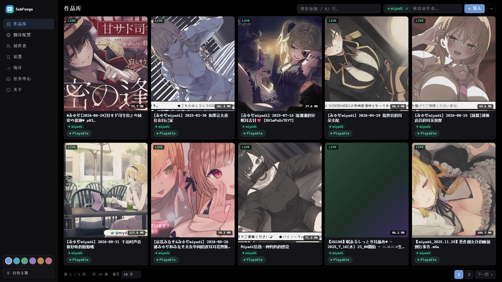
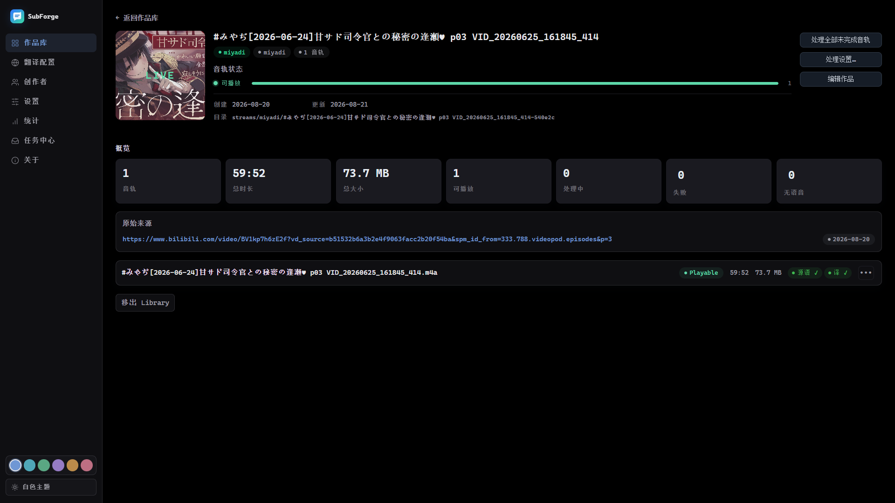
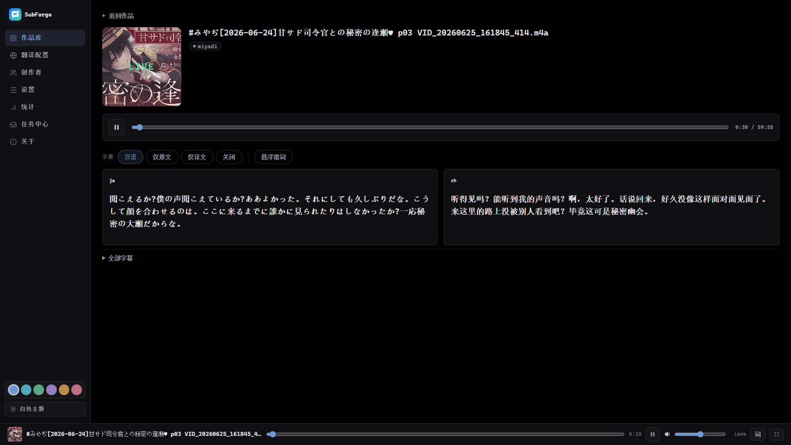
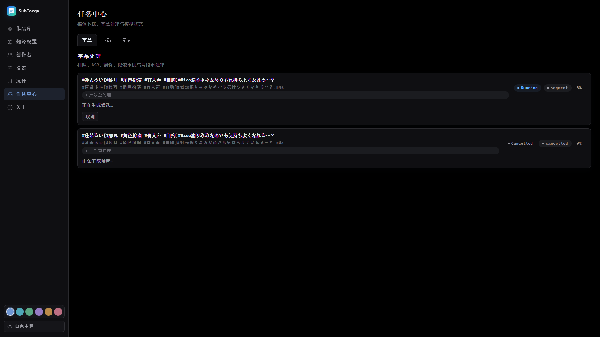
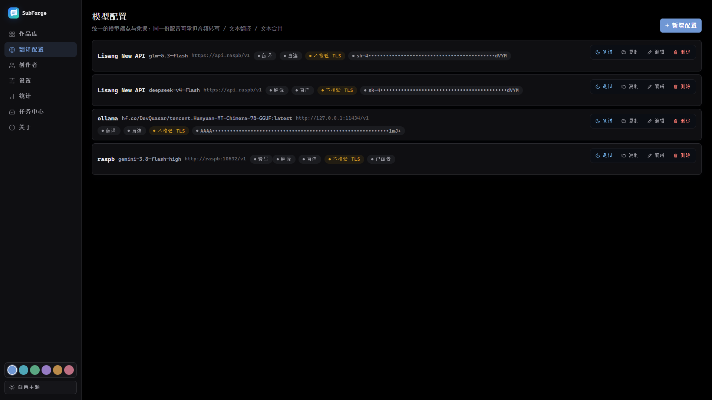

# SubForge

<div align="center">

**面向同人音声与 ASMR 的本地字幕翻译工作台**

用 faster-whisper / Deepgram / Gemini 类模型识别日语音频，再用 LLM 翻译成中文，输出中日双语 SRT。包含作品库、任务中心、字幕校正和双语播放器。

[](pyproject.toml)
[](LICENSE)

</div>

[](docs/assets/images/readme/library.png)

> 截图使用本地示例数据，仅用于界面演示。点击图片可查看高分辨率原图。

<table>
  <tr>
    <td width="50%">
      <a href="docs/assets/images/readme/detail.png">
        
      </a>
      <p align="center"><sub><b>作品详情</b>：音轨管理、状态概览与独立处理</sub></p>
    </td>
    <td width="50%">
      <a href="docs/assets/images/readme/player.png">
        
      </a>
      <p align="center"><sub><b>双语播放器</b>：原文 / 译文 / 双语同步播放与片段重处理</sub></p>
    </td>
  </tr>
  <tr>
    <td width="50%">
      <a href="docs/assets/images/readme/task-center.png">
        
      </a>
      <p align="center"><sub><b>任务中心</b>：统一查看排队、ASR、翻译与限流重试</sub></p>
    </td>
    <td width="50%">
      <a href="docs/assets/images/readme/model-profiles.png">
        
      </a>
      <p align="center"><sub><b>模型配置</b>：同一份 Profile 可复用于转写、翻译与合并</sub></p>
    </td>
  </tr>
</table>

## 为什么是 SubForge

同人音声的主力场景是 ASMR、低语和长音频。通用字幕工具经常漏掉短促气音，或把耳语识别成幻觉文本。SubForge 把这类内容作为核心场景：

- **ASMR 优先**：低阈值 VAD、响度预处理、幻觉抑制，尽量保留低语音频；
- **本地优先**：Library、模型缓存和任务状态都在本机；UI 只监听 `127.0.0.1`；
- **窄而深**：专注日语音频到中文字幕，而不是做泛用多语言字幕工具；
- **不改动来源**：导入时复制音频或提取视频音轨，原始文件不会被移动、修改或删除。

```text
音频 / 视频 → 导入 Library → ASR → 时间轴修正 → LLM 翻译 → 中日双语 SRT → 本地播放 / 片段重处理
```

## 核心能力

### 本地 Library 工作台

```bash
subforge ui
```

- **作品库**：封面墙、搜索、筛选、RJ 作品和直播归档；
- **导入**：单音频、RJ 作品目录、下载任务和 URL 导入；常见视频会提取为 M4A；
- **创作者管理**：社团 / 声优作为可复用实体，支持创建、编辑、合并和筛选；
- **双语播放器**：仅原文、仅译文、双语、关闭四种模式，支持悬浮歌词和全局播放栏；
- **任务中心**：统一查看排队、进度、限流重试、取消、失败原因和候选结果。

### 字幕处理

- **ASR 后端**：本地 faster-whisper，可选 Deepgram；UI 中的统一模型 Profile 还支持 Gemini 类音频模型；
- **长音频分片**：按语音区间和单次请求上限自动分片，避免超长音频直接打爆模型；
- **时间轴所有权**：模型只生成文本层，绝对时间轴由 SubForge 确定性生成与修正；
- **断点续跑**：复用完整结果、已有日文 SRT 和已完成的翻译批次；
- **片段重处理**：只重做某一段字幕，候选结果可跨重启保留、评审和接受。

### 模型配置

SubForge 用统一的模型 Profile 管理三类能力：

| 能力 | 用途 |
|------|------|
| `transcribe` | 音频转写，可作为 ASR 模型 |
| `translate` | 文本翻译 |
| `merge` | 分片结果的文本层校对与合并 |

支持本地 faster-whisper、Deepgram、OpenAI 兼容端点以及 Google `generateContent`。DeepSeek、OpenAI、Groq、Ollama、LM Studio 等兼容服务都可以接入。API Key 留空时不会覆盖已保存的值。

## 快速开始

前置要求：

- Python >= 3.11
- [uv](https://docs.astral.sh/uv/)
- [ffmpeg](https://ffmpeg.org/)（音频预处理和视频导入需要）

### 从源码运行

```bash
git clone <repository-url>
cd subforge
uv sync
uv run subforge ui
```

### 安装当前发布版

```bash
uv tool install .
# 或通过远程 git 仓库安装：
# uv tool install git+<repository-url>
subforge ui
```

首次启动 Library UI 时选择本地归档根目录。之后可以在设置页配置模型、代理、并发、缓存目录和任务参数。

## CLI 批处理

```bash
# 普通日语音频 → 中日双语字幕
subforge audio.mp3

# ASMR / 耳语作品
subforge audio.m4a --asmr

# 使用已保存的模型 Profile
subforge audio.m4a --profile DeepSeek

# 试运行：预检并输出处理计划
subforge ./RJ01499022/ --dry-run

# GPU 加速
subforge audio.m4a --asmr --device auto --compute-type float16

# 使用 Deepgram 云端 ASR
subforge audio.m4a --asr-provider deepgram

# 批量处理一个 RJ 作品目录
subforge ./RJ01499022/ --asmr --device auto --concurrency 2

# 忽略已有字幕与断点，从 ASR 阶段重新处理
subforge audio.m4a --force

# 仅重新翻译（保留已识别的日文字幕）
subforge audio.m4a --mode retranslate --profile DeepSeek

# 常用辅助命令：
subforge profiles list            # 查看已配置的模型 Profile 列表
subforge models download large-v3 # 预下载 Whisper 模型
subforge check                    # 环境依赖与 API 连通性体检
```

每个输入文件会输出两份字幕：

| 文件 | 内容 |
|------|------|
| `audio.ja.srt` | 日文源语言字幕 |
| `audio.zh.srt` | 中文翻译字幕 |

支持格式：`.mp3`、`.mp4`、`.wav`、`.m4a`、`.flac`。

## 配置

首次运行会生成 `~/.subforge/config.toml`。API Key 可以写入配置，也可以通过环境变量提供：

```bash
# LLM 翻译
export LLM_API_KEY=sk-your-key
export LLM_BASE_URL=https://api.deepseek.com/v1
export LLM_MODEL=deepseek-chat

# 可选：Deepgram 云端 ASR
export DEEPGRAM_API_KEY=dg-your-key
```

常用配置：

```toml
[asr]
provider = "local"              # local / deepgram
model = "large-v3"
device = "auto"
compute_type = "float16"

[translate]
target_lang = "zh"
batch_size = 20
workers = 8

[llm]
api_key = ""
base_url = "https://api.deepseek.com/v1"
model = "deepseek-chat"

[processing]
concurrency = 2
output_dir = ""                 # 空值表示输出到源文件目录
```

> Deepgram 会把音频上传到云端，并可能产生 API 费用。处理隐私内容前，请先确认账号额度与数据策略。

## ASR 模型选择

| 模型 | 资源占用 | 速度 | 精度 | 建议场景 |
|------|----------|------|------|----------|
| `tiny` | 最低 | 最快 | 一般 | 测试与快速预览 |
| `base` | 低 | 很快 | 尚可 | 简单清晰的对话 |
| `small` | 较低 | 快 | 良好 | 日常音频 |
| `medium` | 中 | 中等 | 很好 | 普通日语内容 |
| `large-v3` | 高 | 慢 | 最佳 | ASMR、低语与复杂音频 |

首次使用本地 ASR 时会下载模型到 `~/.subforge/models/`。离线机器也可以在设置页指定包含 `model.bin` 与 `config.json` 的 CTranslate2 模型目录。

## CLI 速查

```text
subforge INPUTS... [OPTIONS]

  --model TEXT
  --asr-provider local|deepgram
  --device cpu|cuda|auto
  --compute-type default|auto|float16|int8_float16|int8|float32
  --source-lang TEXT
  --target-lang TEXT
  --asmr
  --llm-api-key TEXT
  --llm-base-url TEXT
  --llm-model TEXT
  --deepgram-api-key TEXT
  --deepgram-model TEXT
  --concurrency INTEGER RANGE   必须 >= 1
  --output-dir PATH
  --force
  --config PATH
  --log-level DEBUG|INFO|WARNING|ERROR
  --version
```

## 断点续跑

SubForge 默认启用断点续跑，状态文件保存在 `~/.subforge/jobs/`：

1. 已存在有效的 `audio.zh.srt`：跳过整个文件；
2. 已存在有效的 `audio.ja.srt`：跳过 ASR，只执行翻译；
3. 翻译中断：重跑时只提交未完成批次；
4. 状态文件损坏或与当前输入不匹配：忽略该状态并安全地重新处理；
5. `--force`：忽略已有 SRT 与断点状态，从 ASR 重新开始。

## 文档

完整手册由 MkDocs Material 构建，支持本地直接预览或在线查阅：

| 想做什么 | 看哪页 |
|----------|--------|
| 安装与配置 | [安装与配置](docs/install.md) |
| 使用 CLI 批处理 | [CLI 批处理](docs/cli.md) |
| 导入、播放、校正字幕 | [Library 工作台](docs/library-ui.md) |
| 配置模型 Profile | [模型配置](docs/model-profiles.md) |
| 查看任务与候选评审 | [任务中心](docs/tasks.md) |
| 只重做某一段 | [片段重处理](docs/segment-reprocess.md) |
| 查看排障与 FAQ | [FAQ](docs/faq.md) |

本地预览：

```bash
uv sync --group docs
uv run mkdocs serve
```

## 开发

```bash
uv sync
uv run pytest tests/ -q
uv run subforge --help
```

CLI 端到端测试会使用临时配置与断点目录，不会读取个人配置、调用真实 Deepgram 或污染个人断点文件。

### 项目结构

```text
subforge/
├── cli.py                 # Click CLI 入口
├── config.py              # TOML / 环境变量 / CLI 配置合并
├── models.py              # Job / SubtitleEntry 数据模型
├── orchestrator.py        # ASR → timeline → translate 主流程
├── resume.py              # 断点状态、校验与恢复
├── events.py              # 结构化处理事件
├── library.py             # Library 文件模型、导入与可重建索引
├── worker.py              # 独立处理 Worker / JSONL 事件
├── scanner.py             # 文件和目录扫描
├── timeline.py            # 时间轴后处理
├── ui/                    # Starlette 工作台、任务队列、模板和播放器
├── asr/
│   ├── deepgram.py        # Deepgram 云端 ASR
│   ├── engine.py          # faster-whisper 本地 ASR
│   └── model_manager.py   # Whisper 模型缓存检测
└── translate/
    ├── context.py         # 批次构建与并发翻译
    ├── llm_client.py      # OpenAI 兼容 LLM 客户端
    └── srt_io.py          # SRT 文件读写
```

## 后续安排

开发顺序已经确定：

1. **批处理打磨与公开化**：保持文档、测试、打包和实现一致；
2. **本地作品库 UI**：单文件闭环、RJ 整包、任务中心和字幕校正已完成；
3. **实时翻译**：Windows 系统音频捕获、流式 ASR、低延迟本地翻译。

详细范围、验收条件和明确不做事项见 [ROADMAP.md](ROADMAP.md)。

## 致谢

- [faster-whisper](https://github.com/SYSTRAN/faster-whisper) — 基于 CTranslate2 的 Whisper 推理实现
- [OpenAI Whisper](https://github.com/openai/whisper) — 本地 ASR 使用的基础模型
- [Deepgram](https://deepgram.com/) — 可选的云端 ASR 后端

## 许可证

[MIT License](LICENSE)
