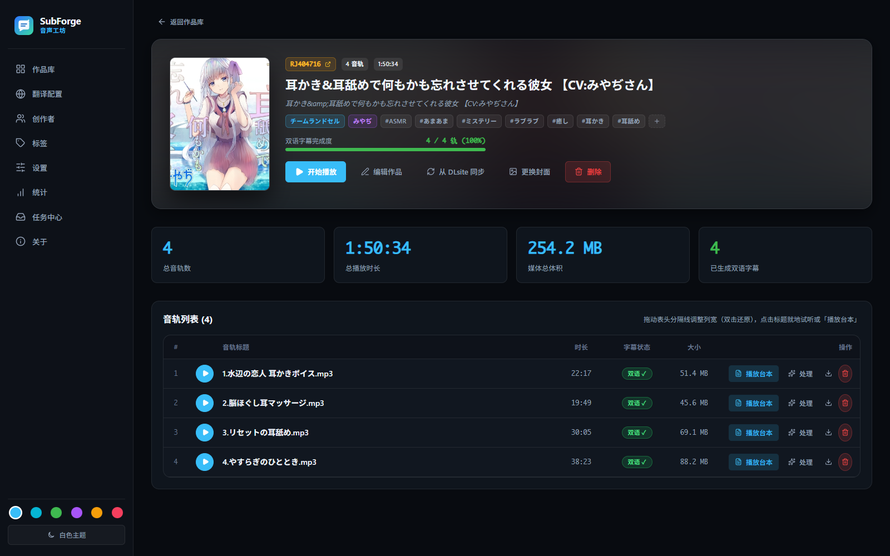
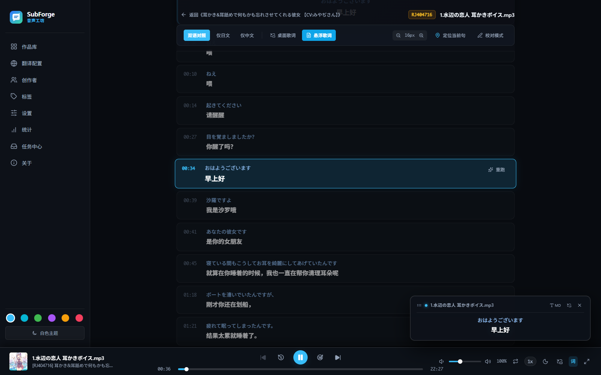
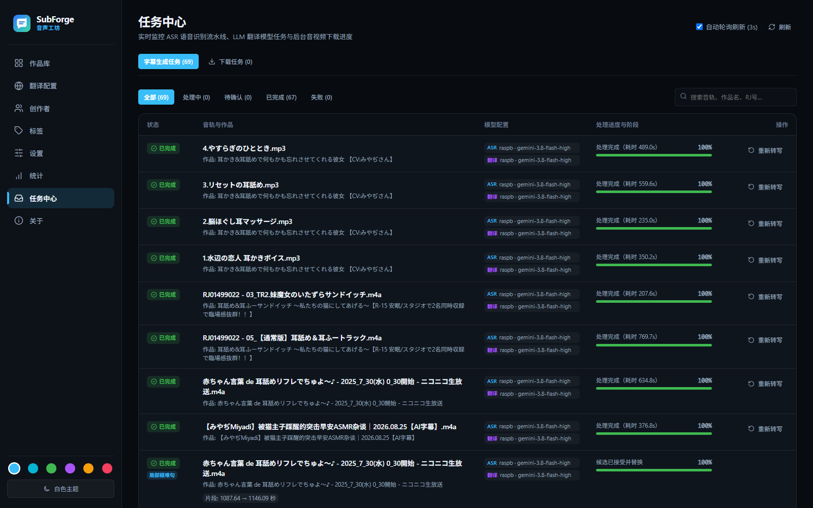
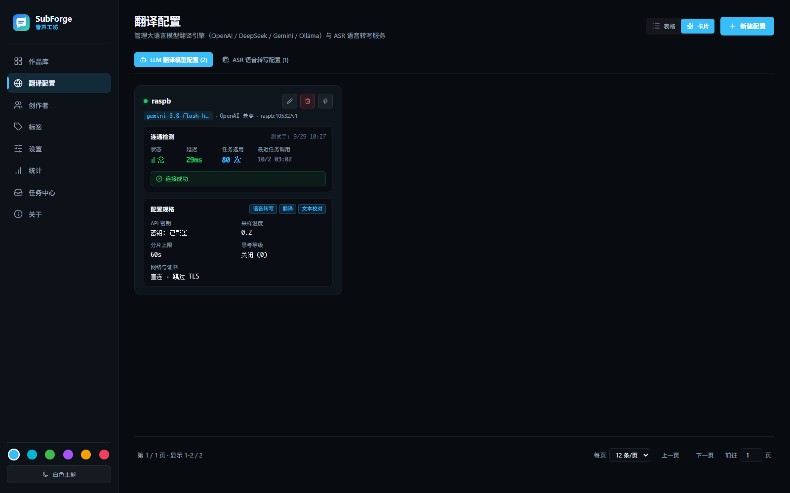
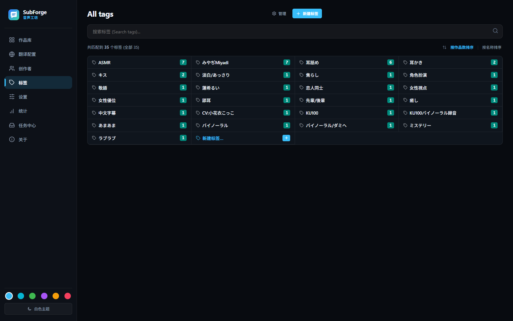
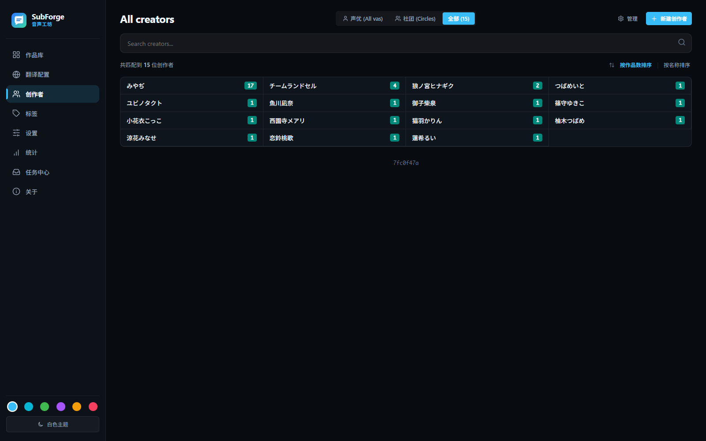

# SubForge

<div align="center">

**面向同人音声与 ASMR 的本地字幕翻译工作台**

用 faster-whisper / Deepgram / Gemini 类音频模型识别日语，再交给 LLM 翻译成中文，输出中日双语 SRT。<br>
作品库、DLsite 元数据、标签与创作者管理、任务中心、双语播放器、桌面歌词，都在本机一个 Web 工作台里完成。

[](pyproject.toml)
[](frontend/)
[](https://loslisang.github.io/subforge/)
[](LICENSE)

</div>

[](docs/assets/images/readme/library.png)

> 截图来自作者本地作品库，已隐藏部分条目，仅用于界面演示。点击图片查看原图。

<table>
  <tr>
    <td width="50%">
      <a href="docs/assets/images/readme/detail.png">
        
      </a>
      <p align="center"><sub><b>作品详情</b>：DLsite 元数据一键同步，音轨状态与单轨处理</sub></p>
    </td>
    <td width="50%">
      <a href="docs/assets/images/readme/player.png">
        
      </a>
      <p align="center"><sub><b>双语播放器</b>：台本跟随高亮、悬浮歌词、桌面置顶歌词</sub></p>
    </td>
  </tr>
  <tr>
    <td width="50%">
      <a href="docs/assets/images/readme/task-center.png">
        
      </a>
      <p align="center"><sub><b>任务中心</b>：ASR / 翻译 / 片段重处理统一排队与重试</sub></p>
    </td>
    <td width="50%">
      <a href="docs/assets/images/readme/model-profiles.png">
        
      </a>
      <p align="center"><sub><b>模型配置</b>：一份 Profile 复用于转写、翻译与合并校对</sub></p>
    </td>
  </tr>
  <tr>
    <td width="50%">
      <a href="docs/assets/images/readme/tags.png">
        
      </a>
      <p align="center"><sub><b>标签管理</b>：重命名、合并、删除，点标签即筛选</sub></p>
    </td>
    <td width="50%">
      <a href="docs/assets/images/readme/creators.png">
        
      </a>
      <p align="center"><sub><b>创作者</b>：声优 / 社团作为实体管理，同名自动去重</sub></p>
    </td>
  </tr>
</table>

## 为什么是 SubForge

同人音声的主力场景是 ASMR、低语和长音频。通用字幕工具经常漏掉短促气音，或把耳语识别成幻觉文本。SubForge 把这类内容作为核心场景：

- **ASMR 优先**：低阈值 VAD、响度预处理、幻觉抑制，尽量保留低语；
- **本地优先**：作品库、模型缓存和任务状态都在本机，UI 只监听 `127.0.0.1`；
- **窄而深**：专注日语音频到中文字幕，不做泛用多语言字幕工具；
- **不动源文件**：导入时复制音频或提取视频音轨，原始文件不会被移动、修改或删除。

```text
音频 / 视频 / RJ 目录 → 导入作品库（自动拉取 DLsite 元数据）→ ASR → 时间轴修正 → LLM 翻译
                     → 中日双语 SRT → 双语播放 / 桌面歌词 / 片段重处理 / 字幕校对
```

## 功能一览

### 作品库与元数据

```bash
subforge ui        # 打开 http://127.0.0.1:8765
```

- **封面墙 / 列表视图**：按标题、RJ 号、声优、社团、`#标签` 搜索；按创作者、标签、作品类型（RJ 作品 / 录播）和字幕状态（双语就绪 / 仅中字 / 仅日文 / 未转写）筛选；
- **DLsite 元数据**：导入时识别目录名或文件名里的 RJ 号，自动拉取标题、社团、声优、标签、发售日和封面；已有作品也可以在详情页一键“从 DLsite 同步”；
- **多种导入方式**：单个音频、整包 RJ 目录（递归扫描，常见视频转为 M4A）、URL 导入；批量导入允许部分成功；
- **标签管理**：新建、重命名（所有作品同步更新，改成已有标签名即合并）、删除；作品卡片上的标签点一下就能筛选；
- **创作者管理**：声优 / 社团作为可复用实体，支持新建、编辑、合并；同名创作者自动去重合并。

### 播放与校对

- **双语播放器**：双语对照 / 仅日文 / 仅中文三种台本模式，跟随播放高亮当前句，可调字号、一键定位；
- **悬浮歌词与桌面歌词**：应用内悬浮歌词条，或画中画（PiP）独立置顶小窗，切到别的应用也能看字幕；
- **全局播放栏**：切换页面不中断播放，支持循环、倍速和睡眠定时；
- **校对模式**：直接编辑字幕文本、拆分合并句子，修改前自动快照，可随时还原；
- **片段重处理**：觉得某句不对就点“重跑”，只重新识别、翻译这一段，候选结果审阅后再替换。

### 任务中心与模型

- **统一任务队列**：媒体导入、ASR、翻译和片段重处理都在一张表里，显示所用 ASR / 翻译模型、进度和耗时；
- **可靠重试**：限流自动退避，无进展才计入失败；失败或取消的任务可以手动重试，任务和候选结果跨重启保留；
- **并发分域**：本地 Whisper（受限于显存）与网络 ASR（受限于 API 配额）各用一个信号量，互不抢占；
- **统一模型 Profile**：同一份配置可同时标记为 `transcribe` / `translate` / `merge` 三种能力，每张卡片显示连通检测、延迟和调用次数。

| 能力 | 用途 |
|------|------|
| `transcribe` | 音频转写，可作为主流程 ASR |
| `translate` | 文本翻译 |
| `merge` | 分片结果的文本层校对与合并（不改时间轴） |

支持本地 faster-whisper、Deepgram、OpenAI 兼容端点以及 Google `generateContent`；DeepSeek、OpenAI、Gemini、Groq、Ollama、LM Studio 等服务都可以接入。API Key 留空保存时不会覆盖已有的值。

### 字幕处理

- **长音频分片**：按语音区间和单次请求上限自动切块，避免超长音频把模型打爆；
- **时间轴由程序决定**：模型只产出文本，绝对时间轴由 SubForge 确定性生成与修正；
- **无语音终态**：识别不到人声时标记为 `no_speech`，不当作失败；
- **断点续跑**：复用已完成的结果、已有日文 SRT 和已翻译的批次。

### 离线批处理 CLI

```bash
subforge audio.mp3
```

不经过作品库，直接对文件或目录批量出字幕：`--profile` 复用 Web 端保存的模型配置，`--mode retranslate` 只重新翻译，`--dry-run` 先预览处理计划，终端显示 Rich 多任务进度。详见下方 [CLI 批处理](#cli-批处理)。

## 快速开始

前置要求：

- Python >= 3.11
- [uv](https://docs.astral.sh/uv/)
- [ffmpeg](https://ffmpeg.org/)（音频预处理和视频导入需要）
- [Node.js](https://nodejs.org/) 20.19 / 22.12 或更新（构建前端界面）

```bash
git clone https://github.com/LosLiSang/subforge.git
cd subforge

# 1. 构建前端（产物输出到 subforge/ui/dist/，仓库不附带）
cd frontend && npm install && npm run build && cd ..

# 2a. 装成全局命令
uv tool install .
subforge ui

# 2b. 或者直接在源码目录运行
uv sync
uv run subforge ui
```

首次启动时选择本地归档根目录，浏览器打开 <http://127.0.0.1:8765>。之后在「翻译配置」页添加模型 Profile，在「设置」页调整代理、并发、缓存目录和默认封面。

> 仓库不附带构建好的前端：首次安装和每次 `git pull` 之后都要重新执行 `npm run build`。不要直接 `uv tool install git+https://…`，那样不会构建前端，打开的是旧版页面。

## CLI 批处理

```bash
# 普通日语音频 → 中日双语字幕
subforge audio.mp3

# ASMR / 耳语作品
subforge audio.m4a --asmr

# 直接复用 Web 端已保存的模型 Profile（免去手输 Key 和 URL）
subforge audio.m4a --profile DeepSeek

# 仅重新翻译：保留耗时识别出的日文字幕，仅重写中文字幕
subforge audio.m4a --mode retranslate --profile DeepSeek

# 试运行（Dry-run）：预检目录并输出计划（全处理 / 仅翻译 / 断点续跑 / 跳过）
subforge ./RJ01499022/ --dry-run

# 原生音频模型 ASR（如调用已配置的 Gemini 或音频模型分片识别）
subforge audio.m4a --asr-profile GeminiAudio

# GPU 加速与多文件并发
subforge audio.m4a --asmr --device auto --compute-type float16
subforge ./RJ01499022/ --asmr --device auto --concurrency 2

# 忽略已有字幕与断点状态，强制从 ASR 阶段重新处理
subforge audio.m4a --force

# 常用辅助命令：
subforge status                   # 环境与服务运行状态概览
subforge profiles list            # 查看已配置的模型 Profile 列表
subforge models download large-v3 # 预下载 Whisper 模型
subforge check                    # 环境依赖与 API 连通性体检
```

每个输入文件会输出两份字幕：

| 文件 | 内容 |
|------|------|
| `audio.ja.srt` | 日文源语言字幕 |
| `audio.zh.srt` | 中文翻译字幕 |

支持格式：`.mp3`、`.mp4`、`.wav`、`.m4a`、`.flac`。

## 配置

首次运行会生成 `~/.subforge/config.toml`。API Key 可以写入配置，也可以通过环境变量提供：

```bash
# LLM 翻译
export LLM_API_KEY=sk-your-key
export LLM_BASE_URL=https://api.deepseek.com/v1
export LLM_MODEL=deepseek-chat

# 可选：Deepgram 云端 ASR
export DEEPGRAM_API_KEY=dg-your-key
```

常用配置：

```toml
[asr]
provider = "local"              # local / deepgram
model = "large-v3"
device = "auto"
compute_type = "float16"

[translate]
target_lang = "zh"
batch_size = 20
workers = 20

[llm]
api_key = ""
base_url = "https://api.deepseek.com/v1"
model = "deepseek-chat"

[processing]
concurrency = 2
output_dir = ""                 # 空值表示输出到源文件目录
```

> Deepgram 会把音频上传到云端，并可能产生 API 费用。处理隐私内容前，请先确认账号额度与数据策略。

## ASR 模型选择

| 模型 | 资源占用 | 速度 | 精度 | 建议场景 |
|------|----------|------|------|----------|
| `tiny` | 最低 | 最快 | 一般 | 测试与快速预览 |
| `base` | 低 | 很快 | 尚可 | 简单清晰的对话 |
| `small` | 较低 | 快 | 良好 | 日常音频 |
| `medium` | 中 | 中等 | 很好 | 普通日语内容 |
| `large-v3` | 高 | 慢 | 最佳 | ASMR、低语与复杂音频 |

首次使用本地 ASR 时会下载模型到 `~/.subforge/models/`。离线机器也可以在设置页指定包含 `model.bin` 与 `config.json` 的 CTranslate2 模型目录。

## CLI 速查

```text
subforge [OPTIONS] <AUDIO_OR_DIR>... | <COMMAND> [ARGS]...

命令：
  ui                              启动本地 Library UI Web 工作台服务
  status                          查看环境、模型、Profile 与断点运行状态
  check (doctor)                  全面体检 Python、FFmpeg、CUDA 与 API 连通性
  models                          查看与预下载本地 faster-whisper 模型
  profiles                        查看已配置的模型 Profile 并测试连接
  jobs                            查看或清理批处理断点恢复记录

批处理核心选项：
  -m, --model TEXT                Whisper 模型：tiny/base/small/medium/large-v3
  --asr-provider local|deepgram|model
  --asr-profile TEXT              使用指定模型 Profile 作为 ASR 识别引擎
  --profile TEXT                  直接使用 Web 配置好的翻译模型 Profile
  --mode continue|retranslate|force
                                  continue（断点续跑）/ retranslate（仅重译）/ force（从头重做）
  --retranslate-only              --mode retranslate 的快捷开关
  --scene asmr|general            场景预设：asmr（低 VAD 阈值、响度归一化）/ general
  --asmr                          --scene asmr 的快捷开关
  --dry-run                       预检扫描目录并打印处理计划，不消耗 token
  --force                         --mode force 的快捷开关
  --device cpu|cuda|auto          计算设备
  --compute-type default|auto|float16|int8_float16|int8|float32
  --source-lang TEXT
  --target-lang TEXT
  --concurrency INTEGER RANGE     并行处理文件数（必须 >= 1）
  --translate-workers INTEGER     并行翻译 Worker 数（必须 >= 1）
  --prompt TEXT                   自定义翻译提示词规则
  --output-dir PATH               字幕输出目录（默认与源文件同级）
  -h, --help                      显示帮助信息并退出
  -v, --version                   显示版本并退出
```

## 断点续跑

SubForge 默认启用断点续跑，状态文件保存在 `~/.subforge/jobs/`：

1. 已存在有效的 `audio.zh.srt`：跳过整个文件；
2. 已存在有效的 `audio.ja.srt`：跳过 ASR，只执行翻译；
3. 翻译中断：重跑时只提交未完成批次；
4. 状态文件损坏或与当前输入不匹配：忽略该状态并安全地重新处理；
5. `--mode retranslate`（`--retranslate-only`）：保留已有的 `audio.ja.srt`，清空翻译缓存并从头重新翻译 `audio.zh.srt`；
6. `--force`：忽略已有 SRT 与断点状态，从 ASR 重新开始。

## 文档

完整手册：**<https://loslisang.github.io/subforge/>**（由 [Zensical](https://zensical.org/) 构建，源文件在 `docs/`）。

| 想做什么 | 看哪页 |
|----------|--------|
| 安装并第一次启动 | [安装与启动](docs/install.md) |
| 从导入到出字幕走一遍 | [5 分钟处理第一部作品](docs/quickstart.md) |
| 导入、DLsite 信息、标签、播放 | [作品库与播放](docs/library-ui.md) |
| 选择识别和翻译模型 | [模型配置](docs/model-profiles.md) |
| 看进度、处理失败 | [任务中心](docs/tasks.md) |
| 只重做某一段 | [片段重跑](docs/segment-reprocess.md) |
| 命令行批量出字幕 | [命令行批处理](docs/cli.md) |
| 遇到问题 | [常见问题](docs/faq.md) |
| 内部实现与开发 | [开发者参考](docs/dev/index.md) |

本地预览：

```bash
uv run --only-group docs zensical serve
```

## 开发

```bash
uv sync
uv run pytest tests/ -q     # 单元测试 + 两条黄金旅程集成测试
uv run subforge --help
```

前端（React 19 + TypeScript + Vite）在 `frontend/`，开发时 Vite 会把 API 代理到后端：

```bash
uv run subforge ui           # 后端 127.0.0.1:8765
cd frontend && npm install && npm run dev
npm run build                # 产物输出到 subforge/ui/dist/
```

测试使用临时配置与断点目录，不会读取个人配置、调用真实 Deepgram 或污染个人断点文件。

### 项目结构

```text
subforge/
├── cli.py                 # Typer CLI 入口
├── config.py              # TOML / 环境变量 / CLI 配置合并
├── orchestrator.py        # ASR → timeline → translate 主流程
├── resume.py              # 断点状态、校验与恢复
├── library.py             # 作品库文件模型、导入、标签与创作者
├── dlsite.py              # RJ 号识别与 DLsite 元数据 / 封面抓取
├── segment_processing.py  # 片段重处理
├── subtitle_revision.py   # 字幕校对与快照还原
├── worker.py              # 独立处理 Worker / JSONL 事件
├── timeline.py            # 时间轴后处理
├── ui/                    # FastAPI 后端、任务队列、模型 Profile、前端构建产物 dist/
├── asr/                   # faster-whisper / Deepgram / 模型缓存
└── translate/             # 批次构建、OpenAI 兼容客户端、SRT 读写
frontend/                  # React 19 + TypeScript + Vite 前端源码
docs/                      # Zensical 文档源（dev/ 为开发者参考，配置见 mkdocs.yml）
tests/
├── unit/                  # 纯逻辑表驱动单测
└── integration/           # 作品库 / 处理流水线黄金旅程
```

## 后续安排

开发顺序已经确定：

1. **批处理打磨与公开化**：保持文档、测试、打包和实现一致；
2. **本地作品库 UI**：单文件闭环、RJ 整包、DLsite 元数据、标签与创作者、任务中心、字幕校对和桌面歌词已完成；
3. **实时翻译**：Windows 系统音频捕获、流式 ASR、低延迟本地翻译。

详细范围、验收条件和明确不做事项见 [ROADMAP.md](ROADMAP.md)。

## 致谢

- [faster-whisper](https://github.com/SYSTRAN/faster-whisper) — 基于 CTranslate2 的 Whisper 推理实现
- [OpenAI Whisper](https://github.com/openai/whisper) — 本地 ASR 使用的基础模型
- [Deepgram](https://deepgram.com/) — 可选的云端 ASR 后端
- [Zensical](https://zensical.org/) — 文档站构建工具

## 许可证

[MIT License](LICENSE)
