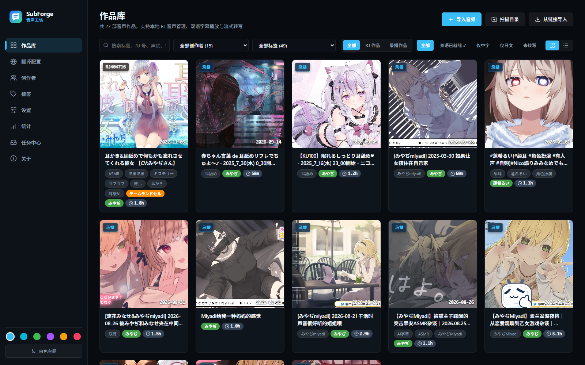

# SubForge

**给同人音声、ASMR 自动配上中日双语字幕的本地工具。**

把日语音声作品导入 SubForge，它会自动识别日语、翻译成中文，生成中日对照字幕，然后你就可以边听边看。

## 它能帮你做什么

- **自动出字幕**：识别日语语音，翻译成中文，生成 `.srt` 双语字幕文件；
- **耳语也能听清**：专门为 ASMR、悄悄话、舔耳这类小音量内容优化，尽量不漏字；
- **管理你的作品库**：封面墙展示，按 RJ 号自动从 DLsite 获取标题、社团、声优、标签和封面；
- **边听边看**：双语台本跟着声音滚动，还能开一个置顶的桌面歌词小窗；
- **改字幕很方便**：错字直接改，整段识别错了只重跑那一段；
- **一切都在你自己的电脑上**：作品和字幕都存在本地，原文件不会被改动。

## 从这里开始

1. [安装与启动](install.md)：准备环境、安装、第一次打开
2. [5 分钟处理第一部作品](quickstart.md)：导入 → 生成字幕 → 边听边看
3. [模型配置](model-profiles.md)：选择识别和翻译用的模型

## 想做什么

| 想做什么 | 看哪页 |
|---|---|
| 导入作品、获取 DLsite 信息、管理标签 | [作品库与播放](library-ui.md) |
| 选择 / 添加识别和翻译模型 | [模型配置](model-profiles.md) |
| 看处理进度、处理失败了怎么办 | [任务中心](tasks.md) |
| 修改字幕里的错字 | [字幕校对](subtitle-revision.md) |
| 某一段识别错了，只重做那一段 | [片段重跑](segment-reprocess.md) |
| 不打开界面，用命令行批量出字幕 | [命令行批处理](cli.md) |
| 遇到问题 | [常见问题](faq.md) |

想了解内部实现或参与开发，请看[开发者参考](dev/index.md)。

---

SubForge 是开源软件（MIT 协议），源码在 [GitHub](https://github.com/LosLiSang/subforge)。
