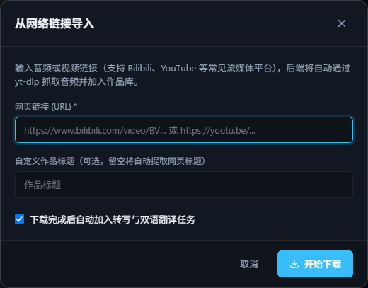
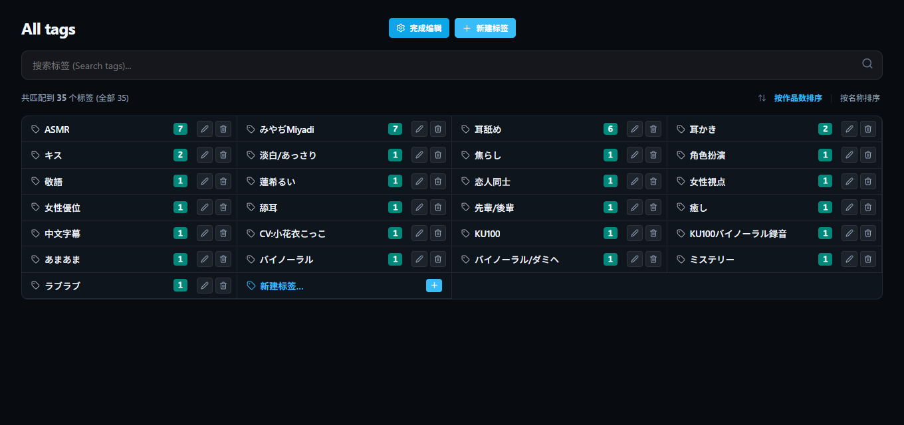

# 作品库与播放

```bash
subforge ui
```

启动后浏览器会打开工作台。左侧菜单依次是：作品库、翻译配置、创作者、标签、设置、统计、任务中心、关于。

{ .shot }

## 浏览作品库

- **两种视图**：右上角可以在「海报网格」和「详细列表」之间切换。
- **搜索**：标题、RJ 号、声优、社团都能搜；输入 `#标签名` 按标签搜。
- **筛选**：
    - 按创作者、标签筛选（两个下拉框）；
    - 按类型：全部 / RJ 作品 / 录播作品；
    - 按字幕进度：双语已就绪 / 仅中字 / 仅日文 / 未转写。
- 作品卡片上的标签和声优名可以直接点，点了就按它筛选。
- 卡片上的「一键播放」会从第一条音轨开始播。

## 导入作品

| 方式 | 说明 |
|------|------|
| **扫描目录** | 选一个作品文件夹，自动扫描里面（包括子文件夹）的所有音频；常见视频会自动转成音频 |
| **导入音频** | 导入单个音频或视频文件 |
| **从链接导入** | 粘贴 B 站、YouTube 等链接，自动下载音频并抓取封面 |

三种方式都可以勾选「导入后自动处理」，导入完就直接开始生成字幕。

<div class="grid" markdown>

{ .shot }

{ .shot }

</div>

!!! info "原文件不会被动到"

    导入是**复制**，原来的文件不会被移动、修改或删除。在 SubForge 里删除作品，也只是挪进作品库里的回收站（`.trash` 文件夹）。

### 作品类型

- **RJ 作品**：DLsite 上的作品，用 RJ 号识别，可以关联多个社团和声优。
- **录播作品**：直播录音、剪辑等，只关联声优。

## DLsite 信息自动获取

只要文件夹名或文件名里有 RJ 号（例如 `RJ01499022`），导入时就能自动从 DLsite 获取：

- 作品标题、发售日、封面
- 社团、声优（会自动对应到已有的创作者，同名的不会重复建）
- 作品标签

已经导入的作品，在详情页点「**从 DLsite 同步**」可以随时重新获取。

!!! tip "获取失败？"

    国内网络访问 DLsite 可能需要代理。在「设置 → 网络代理设置」里填上代理地址（例如 `http://127.0.0.1:7890`）即可。获取失败不影响导入，之后再同步就行。

## 作品详情

{ .shot }

在详情页可以：

- **开始播放**、**编辑作品**（标题、标签、创作者）、**从 DLsite 同步**、**更换封面**、**删除**；
- 查看双语字幕完成度、总时长、总大小；
- 对每条音轨：▶ 就地播放、「播放台本」进入双语播放页、「处理」生成字幕、下载中文字幕、删除音轨；
- 还有没处理完的音轨时，会出现「**处理未完成音轨 (N)**」按钮，一次处理整部作品。

### 场景识别优化（仅本地 Whisper）

| 选项 | 适合 |
|------|------|
| **ASMR 悄悄话强化**（默认） | 耳语、舔耳、助眠类作品。放大小音量、降低静音判定门槛，尽量不漏字 |
| 标准人声对话 | 普通说话音量的广播剧、直播杂谈 |

在线音频模型和 Deepgram 不使用这个选项，所以选它们时不会显示。

### 处理方式怎么选

点「处理」或「处理未完成音轨」会弹出下面的窗口，识别引擎和翻译模型默认是「设置 → 默认模型」里选的那个，也可以临时换。选本地 Whisper 时会多出「场景识别优化」一项（见下方说明）：

{ .shot .dialog }

| 选项 | 什么时候用 |
|------|-----------|
| **断点续跑** | 默认。之前没处理完的，接着处理剩下的部分 |
| **仅重新翻译** | 日文识别得没问题，只想换个模型或提示词重新翻译 |
| **从头重新生成** | 识别结果很差，想换个识别引擎全部重来 |

## 标签与创作者

{ .shot }

- **标签页**：可以按作品数或名称排序，可以新建标签。点右上角「管理」可以：
    - **重命名**：所有作品里的这个标签一起改；
    - **合并**：把一个标签重命名成另一个已有的标签名，两个就合成一个（例如把「耳舐め」改成「舔耳」）；
    - **删除**：同时从所有作品上移除。
- **创作者页**：按声优 / 社团 / 全部分组，显示每人有几部作品。可以新建、编辑、合并；同名的创作者会自动合并成一个。

{ .shot }

## 双语播放

{ .shot }

播放页上方的工具栏：

| 按钮 | 作用 |
|------|------|
| 双语对照 / 仅日文 / 仅中文 | 切换显示哪种字幕 |
| **桌面歌词** | 弹出一个始终置顶的小窗，切到别的软件也能看字幕 |
| **悬浮歌词** | 在页面里显示一条可以拖动的歌词条 |
| 🔍 字号 | 调整台本字号 |
| 定位当前句 | 滚动到正在播放的那一句 |
| 校对模式 | 修改字幕，见[字幕校对](subtitle-revision.md) |

- 点任意一句字幕就跳到那个时间点。
- 每句右侧的「**重跑**」可以单独重新识别这一句，见[片段重跑](segment-reprocess.md)。

### 底部播放栏

切换页面时播放不会中断。支持上一曲 / 下一曲、快退 5 秒 / 快进 30 秒、音量（最高 300%，适合声音特别小的耳语）、单曲 / 列表循环、倍速、**睡眠定时**（定时关闭，或播完当前音轨后停止）。

!!! tip "桌面歌词需要较新的浏览器"

    桌面歌词使用浏览器的「画中画」功能，推荐使用最新版 Chrome 或 Edge。

## 设置

「设置」页按分类排成一排标签，可以调整：

{ .shot }

- **本地媒体库目录**：切换作品库文件夹；
- **默认模型**：默认用哪个引擎识别（本地 Whisper / 在线音频模型 / Deepgram）、哪个模型翻译；选本地 Whisper 时还能设置默认场景（ASMR / 普通对话）；
- **默认封面**：没有封面的作品显示什么图；
- **网络代理**：下载模型、访问 DLsite 和在线模型时使用；
- **并发与性能**：同时跑几个任务（显存小的话，本地识别并发保持 1）；
- **界面**：圆角 / 直角、字体、字号、字幕行距、主题色、深色 / 浅色主题；
- **全局翻译提示词**：告诉翻译模型你喜欢的翻译风格、人名译法等；
- **Deepgram API Key**。
