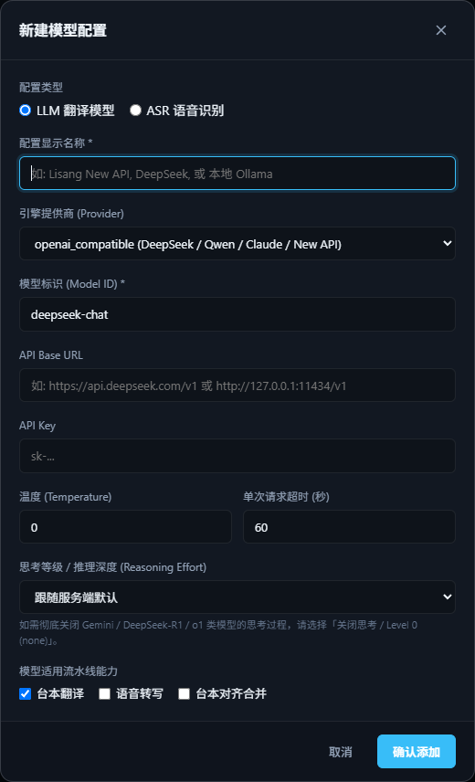
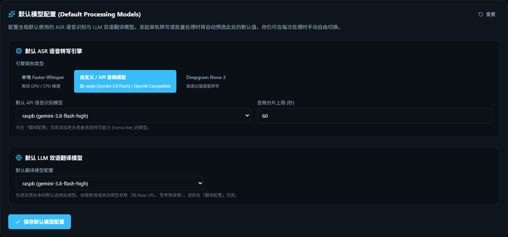

# 模型配置

SubForge 处理一条音轨分两步，每一步都要用到模型：

1. **识别**：把日语语音转成日文文字（也叫 ASR、语音转写）；
2. **翻译**：把日文翻译成中文。

这些模型在左侧「**翻译配置**」页统一管理。每个模型存成一份「配置」，填一次以后处理时直接选就行。

{ .shot }

## 识别用什么？

| 选项 | 优点 | 缺点 |
|------|------|------|
| **本地 Whisper**（faster-whisper） | 免费、离线、隐私好 | 需要较好的显卡才快；首次使用要下载模型（几 GB） |
| **在线音频模型**（Gemini 等） | 不吃本机配置，识别耳语效果好 | 需要 API Key，按用量计费 |
| **Deepgram** | 速度很快 | 需要 API Key、收费；音频会上传到国外服务器 |

!!! tip "推荐"

    - 有 NVIDIA 显卡（显存 6GB 以上）：本地 Whisper `large-v3`；
    - 没有好显卡：Gemini 这类在线音频模型。

## 翻译用什么？

任何兼容 OpenAI 接口的大模型都可以，例如 DeepSeek、通义千问、GPT、Gemini，也可以用本机的 Ollama、LM Studio。

## 添加一份配置

1. 「翻译配置」页右上角点「**新建配置**」。
2. **配置类型**：翻译选「LLM 翻译模型」，识别选「ASR 语音识别」。
3. 填写：

    | 字段 | 怎么填 |
    |------|--------|
    | 配置显示名称 | 随便起，例如 `DeepSeek` |
    | 引擎提供商 | 大多数服务选 `openai_compatible`；Google 官方接口选 `gemini` |
    | 模型标识 | 服务商文档里的模型名，例如 `deepseek-chat` |
    | API Base URL | 服务商提供的接口地址，例如 `https://api.deepseek.com/v1` |
    | API Key | 服务商后台申请的密钥 |

4. **模型适用流水线能力**：勾选这份配置能干什么——
    - **台本翻译**：可以用来翻译；
    - **语音转写**：可以用来识别（只有能听音频的模型才勾，如 Gemini）；
    - **台本对齐合并**：识别完后再整理一遍文字（去重复、修标点），可选。

    同一个模型能同时勾多项，例如 Gemini 可以既识别又翻译。

5. 点「确认添加」，再点卡片右上角的 ⚡ 测试一下连接。

{ .shot .dialog }

卡片上会显示连接状态、延迟和被任务调用过几次。

!!! note "API Key 的安全"

    Key 只保存在你自己的电脑上。编辑配置时 Key 那一栏留空，表示保持原来的 Key 不变。

## 其他选项

| 选项 | 说明 |
|------|------|
| 温度 | 翻译的随机程度。想要稳定、一致的翻译就填低一点（0~0.3） |
| 思考等级 | 对 DeepSeek-R1、Gemini 这类会“先思考”的模型，选「关闭思考」可以更快、更省钱，翻译质量一般影响不大 |
| 分片上限 | 在线音频模型一次最多听多少秒，默认 60 秒。长音频会自动切成小段分别识别，再拼回去 |

## 设置默认模型

在「设置 → 默认模型」里选好默认的识别引擎和翻译模型（本地 Whisper 还可以选默认场景），以后处理时就不用每次选了。

{ .shot }
