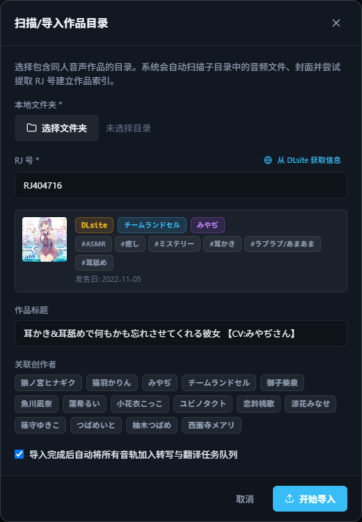
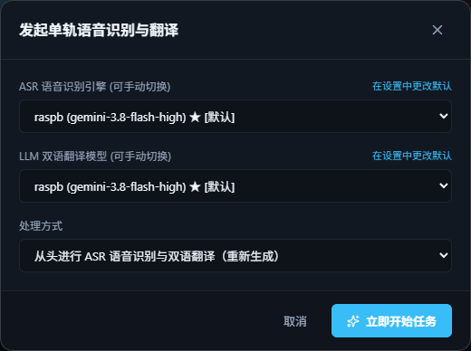

# 5 分钟处理第一部作品

这一页带你从零走完一遍：导入一部作品 → 生成中日双语字幕 → 边听边看。开始前请先完成[安装与启动](install.md)，并至少添加一个翻译模型。

## 1. 导入作品

在「作品库」页右上角选一种导入方式：

| 按钮 | 适合 |
|------|------|
| **扫描目录** | 整部 RJ 作品文件夹（推荐）。会自动扫描子文件夹里的所有音频，视频会自动提取成音频 |
| **导入音频** | 单个音频或视频文件 |
| **从链接导入** | B 站、YouTube 等网页链接，适合直播录播 |

以「扫描目录」为例：

1. 点「选择文件夹」，选中作品所在的文件夹，例如 `RJ01499022 作品名`。
2. 如果文件夹名里带 RJ 号，会自动填好；点「**从 DLsite 获取信息**」，标题、社团、声优、标签和封面会一起填上。
3. 勾选「导入完成后自动将所有音轨加入转写与翻译任务队列」，可以省掉下一步。
4. 点「开始导入」。

{ .shot .dialog }

!!! info "你的原文件不会被动到"

    导入时 SubForge 会把音频**复制**一份到作品库里，原来的文件不会被移动、修改或删除。

## 2. 生成字幕

如果导入时没有勾选自动处理：

1. 在作品库点开刚导入的作品。
2. 点作品信息下方的「**处理未完成音轨**」处理整部作品，或点某条音轨右侧的「处理」只处理这一条。
3. 确认识别引擎和翻译模型（默认就是「设置 → 默认模型」里选的）。如果用的是**本地 Whisper**，下面会多出一个「场景识别优化」，耳语、舔耳类作品保持「**ASMR 悄悄话强化**」即可。
4. 点「立即开始任务」。

{ .shot .dialog }

进度可以在左侧「**任务中心**」查看。一条 20 分钟左右的音轨，在线模型一般几分钟就能处理完；本地 Whisper 视显卡而定。

## 3. 边听边看

处理完成后，音轨状态会变成绿色的「双语 ✓」。

- 点音轨左边的 ▶ 直接播放，底部会出现播放栏。
- 点「**播放台本**」进入双语播放页：字幕跟随播放高亮，点任意一句就跳到那里。
- 想在玩游戏、看网页时也看到字幕，点「**桌面歌词**」，会弹出一个始终置顶的小窗。

## 4. 字幕不满意？

- **个别字词错了**：在播放页点「校对模式」直接修改，见[字幕校对](subtitle-revision.md)。
- **某一段整段识别错了**：点那一句旁边的「重跑」，只重新识别这一小段，见[片段重跑](segment-reprocess.md)。
- **翻译风格不喜欢**：换个翻译模型，处理时选「仅重新翻译」，不用重新识别。

## 字幕文件在哪？

在作品详情页点音轨右侧的下载按钮，可以拿到 `.srt` 字幕文件，放到其他播放器里使用。
