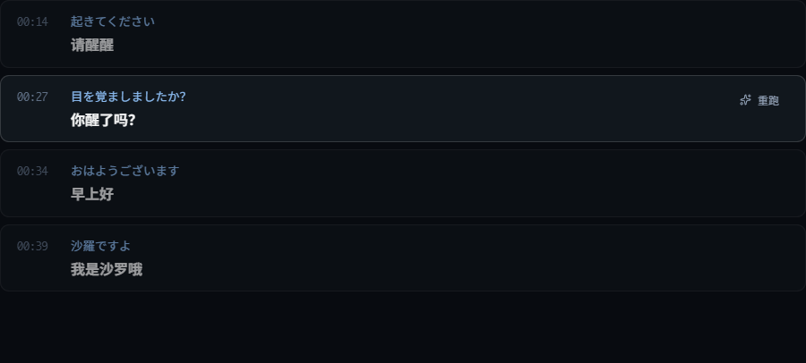
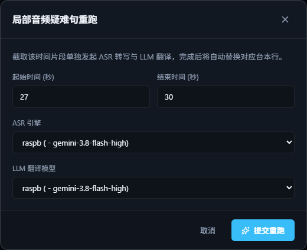

# 片段重跑

整条音轨大体识别得不错，只有某一句或某一小段错了？不用整条重来，只重跑那一段就行。

## 怎么用

1. 进入音轨的双语播放页。
2. 把鼠标移到识别错的那一句上，点右侧出现的「**重跑**」（不在校对模式时才显示）。

    { .shot }

3. 在弹出的窗口里：
    - **起始时间 / 结束时间**（秒）：默认是这一句的时间，可以往前、往后多扩一点，把漏识别的部分也包进来；
    - **ASR 引擎**：本地 Whisper 或在线音频模型，可以换一个和整条处理时不同的；选本地 Whisper 时会多出「场景识别优化」；
    - **LLM 翻译模型**：选一个翻译模型。
4. 点「**提交重跑**」。

{ .shot .dialog }

重跑在后台进行，不影响你继续听。

## 确认结果

重跑完成后，结果不会直接覆盖原来的字幕，而是先放着等你确认：

1. 打开「**任务中心**」，这条任务的状态是「**待确认**」。
2. 点「查看候选」，对比原来的字幕和新结果。
3. 满意就点「**接受并替换正式台本**」；不满意就「放弃」，原来的字幕不变。

!!! tip "放心试"

    - 每次替换前都会自动备份，替换错了也能撤销；
    - 待确认的结果关掉软件也不会丢，下次打开还能继续确认。

## 小技巧

- **整段漏识别**（一段明明有声音却没有字幕）：起止时间框住那段空白，重跑即可补上。
- **换模型试试**：本地 Whisper 识别不好的耳语段，换在线音频模型重跑往往效果更好。
- 时间留空或超出音频长度时，会提示你是否覆盖到音频开头 / 末尾。
