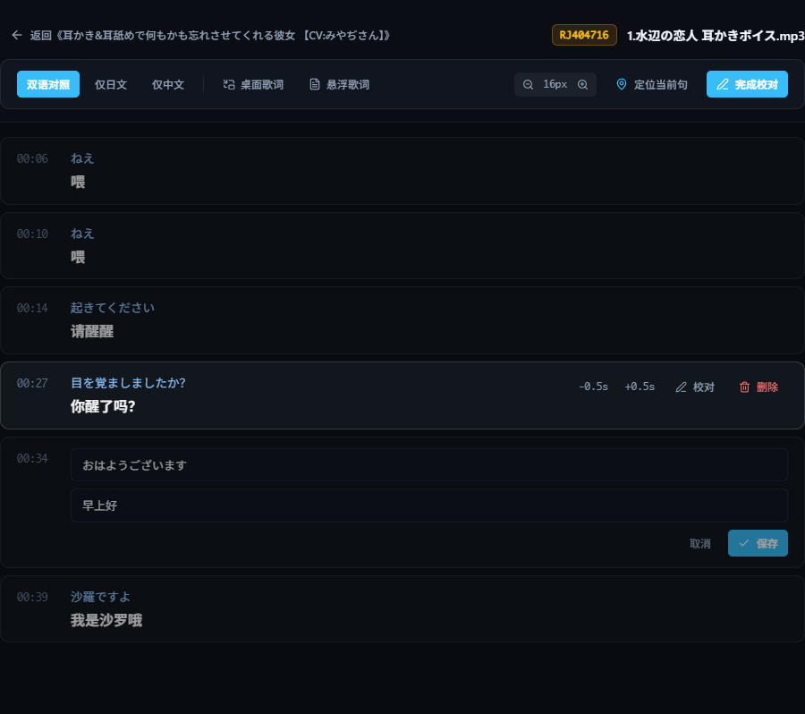

# 字幕校对

自动生成的字幕难免有错字、漏字或时间不准。你可以在播放页直接修改，改完的字幕就是你自己的双语台本。

## 进入校对模式

1. 打开音轨的双语播放页。
2. 点右上角「**校对模式**」。
3. 改完点「**完成校对**」退出。

{ .shot }

## 能改什么

在校对模式下，把鼠标移到某一句上，右侧会出现这些按钮：

| 按钮 | 作用 |
|------|------|
| ✏️ **校对** | 修改这一句的日文原文和中文译文，改完点「保存」 |
| **-0.5s / +0.5s** | 把这一句的时间往前 / 往后挪 0.5 秒，修正字幕比声音早或晚的问题 |
| 🗑 **删除** | 删除这一句（例如没人说话却多出来的字幕） |

退出校对模式后，鼠标移到某一句上会出现「**重跑**」按钮：这一句整个识别错了，可以重新识别，见[片段重跑](segment-reprocess.md)。

## 改错了怎么办？

每次修改保存前，SubForge 都会自动备份一份。日文和中文字幕总是一起保存、一起恢复，不会出现一边改了、一边没改的情况。

## 常见问题

- **结尾多出一句「ご視聴ありがとうございました」？** 这是识别模型在静音段“脑补”出来的，直接删掉即可。SubForge 已经会自动过滤大部分这类句子。
- **整段字幕都偏了一点？** 逐句 ±0.5s 太麻烦的话，可以用[片段重跑](segment-reprocess.md)把那一段重新识别。
